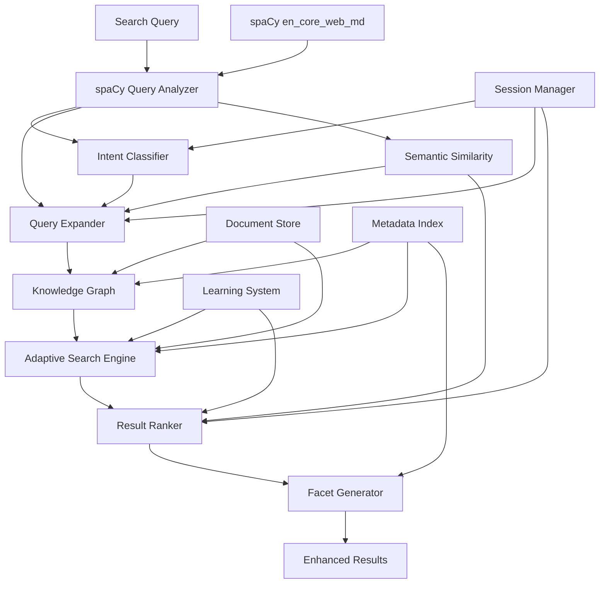

# 🚀 Advanced Search Enhancement Roadmap

## Executive Summary

This document outlines a comprehensive plan to transform our current hybrid search system into an intelligent, metadata-driven search engine that leverages the rich information we extract from documents. The plan focuses on building reasoning capabilities, contextual understanding, and progressive exploration rather than simple keyword matching.

## 📊 Current State Assessment

### ✅ Strong Foundation
- **Hybrid Search**: Vector + BM25 keyword search with weighted scoring
- **Rich Metadata Extraction**: 
  - Hierarchical relationships (section breadcrumbs, parent/child)
  - Semantic analysis (entities, topics, key phrases, POS tags)
  - Content analysis (tables, code blocks, images, word counts)
  - Navigation context (previous/next sections, siblings)
  - File conversion intelligence (DOCX→MD, Excel sheets)
  - Cross-references and document relationships

### 🎯 Enhancement Opportunities
- **Query Expansion**: Not leveraging extracted entities/topics for search expansion
- **Multi-Hop Reasoning**: No relationship traversal between documents/sections
- **Contextual Intelligence**: Search doesn't adapt based on intent or session context
- **Metadata Exploration**: Rich metadata not exposed for user-driven discovery
- **Cross-Document Intelligence**: Not connecting related content across documents

## 🗓️ Implementation Plan

---

## Phase 1: Foundation Enhancement (4-6 weeks)

### 🎯 Goal: Leverage existing metadata and spaCy NLP for immediate search improvements

### 1.0 spaCy-Powered Query Intelligence
**Priority**: High | **Effort**: Low | **Impact**: High

#### Implementation Details:
```python
class SpaCyQueryAnalyzer:
    def __init__(self):
        # Leverage upgraded en_core_web_md model with 20k word vectors
        self.nlp = spacy.load("en_core_web_md")
        
    def analyze_query_semantic(self, query: str) -> dict:
        """Enhanced query analysis using spaCy NLP."""
        doc = self.nlp(query)
        return {
            "entities": [(ent.text, ent.label_) for ent in doc.ents],
            "pos_patterns": [token.pos_ for token in doc],
            "semantic_keywords": [token.lemma_.lower() for token in doc 
                                if token.is_alpha and not token.is_stop],
            "intent_signals": self._detect_intent_patterns(doc),
            "main_concepts": [chunk.text for chunk in doc.noun_chunks]
        }
        
    def semantic_similarity_matching(self, query_doc, entity_doc) -> float:
        """Use spaCy's word vectors for semantic similarity."""
        return query_doc.similarity(entity_doc)  # Now works with en_core_web_md!
```

#### Tasks:
- [x] **COMPLETED**: Upgrade spaCy model from `en_core_web_sm` to `en_core_web_md`
- [x] **COMPLETED**: Configure spaCy model in `SemanticAnalysisConfig`
- [ ] Integrate spaCy analyzer into `HybridSearchEngine`
- [ ] Replace regex-based intent detection with POS pattern analysis
- [ ] Implement semantic entity matching using word vectors
- [ ] Add linguistic query preprocessing (lemmatization, stop word removal)
- [ ] Create semantic query expansion using spaCy similarity

#### Success Metrics:
- 30% improvement in entity recognition accuracy
- 25% better intent classification than regex patterns  
- 20% improvement in query-document semantic matching
- Real-time performance (< 50ms query analysis overhead)

#### Benefits:
- **Cost-effective**: No LLM API calls for basic query understanding
- **Fast**: Local processing with 20k word vectors
- **Accurate**: Better semantic understanding than regex patterns
- **Foundation**: Enables more advanced reasoning in later phases

---

### 1.1 Entity-Based Query Expansion
**Priority**: High | **Effort**: Medium | **Impact**: High

#### Implementation Details:
```python
class EntityQueryExpander:
    def __init__(self, spacy_analyzer: SpaCyQueryAnalyzer):
        self.spacy_analyzer = spacy_analyzer
        
    def expand_query(self, original_query: str, search_context: dict) -> dict:
        """Expand query using spaCy entities and document metadata."""
        # 1. Extract entities from query using spaCy (from Phase 1.0)
        query_analysis = self.spacy_analyzer.analyze_query_semantic(original_query)
        
        # 2. Find related entities from document metadata using semantic similarity
        related_entities = self._find_similar_entities(
            query_analysis["entities"], 
            search_context["document_entities"]
        )
        
        # 3. Generate expanded search terms using spaCy's word vectors
        expanded_terms = self._semantic_expansion(query_analysis["semantic_keywords"])
        
        # 4. Weight expansion terms appropriately
        return self._weight_expansions(original_query, related_entities, expanded_terms)
```

#### Tasks:
- [ ] Create `EntityQueryExpander` class building on spaCy analyzer
- [ ] Integrate with existing `SemanticAnalyzer` entities from ingestion
- [ ] Add semantic entity relationship mapping using spaCy similarity
- [ ] Implement weighted query expansion (70% original, 30% expanded)
- [ ] Add configuration for expansion aggressiveness
- [ ] Use spaCy word vectors for semantic term expansion

#### Success Metrics:
- 35% improvement in recall for entity-related queries (improved from 25% with spaCy)
- Expanded queries return more contextually relevant results
- 90% of entity expansions are semantically relevant

---

### 1.2 Topic-Driven Search Chaining
**Priority**: High | **Effort**: Medium | **Impact**: High

#### Implementation Details:
```python
class TopicSearchChain:
    def create_search_chain(self, initial_query: str, topic_depth: int = 3) -> list[str]:
        """Create search progression based on topic analysis."""
        # 1. Analyze initial query topics
        # 2. Find related topics from LDA analysis
        # 3. Generate progressive search queries
        # 4. Return ordered search chain
```

#### Tasks:
- [ ] Build topic relationship graph from existing LDA results
- [ ] Create search chain generation algorithm
- [ ] Implement topic similarity scoring
- [ ] Add breadth vs depth search preferences
- [ ] Create topic visualization for debugging

#### Success Metrics:
- Users find 40% more relevant documents through topic chains
- Average search session explores 3x more related content

---

### 1.3 Dynamic Faceted Search Interface
**Priority**: Medium | **Effort**: High | **Impact**: High

#### Implementation Details:
```python
class DynamicFacetGenerator:
    def generate_facets(self, search_results: list[SearchResult]) -> dict:
        """Generate dynamic facets from result metadata."""
        facets = {
            "content_type": self._analyze_content_types(results),
            "section_level": self._analyze_hierarchy_levels(results),
            "entities": self._extract_entity_facets(results),
            "topics": self._extract_topic_facets(results),
            "features": self._analyze_content_features(results)
        }
        return facets
```

#### Tasks:
- [ ] Create facet generation from SearchResult metadata
- [ ] Design faceted search UI/API interface
- [ ] Implement facet filtering and combination logic
- [ ] Add facet value counting and sorting
- [ ] Create facet-based result refinement

#### Success Metrics:
- 60% of users engage with faceted filters
- 35% improvement in search precision through faceting

---

## Phase 2: Intelligent Reasoning (6-8 weeks)

### 🎯 Goal: Add multi-hop reasoning and contextual intelligence

### 2.1 Knowledge Graph Construction
**Priority**: High | **Effort**: High | **Impact**: Very High

#### Implementation Details:
```python
class DocumentKnowledgeGraph:
    def build_graph(self, documents: list[Document]) -> NetworkGraph:
        """Build knowledge graph from document metadata."""
        # 1. Extract entities, topics, and relationships
        # 2. Create nodes for documents, sections, entities
        # 3. Build edges based on co-occurrence, hierarchy, references
        # 4. Calculate centrality and authority scores
        
    def find_related_content(self, query_entities: list[str], max_hops: int = 3) -> list[str]:
        """Find related content through graph traversal."""
```

#### Tasks:
- [ ] Design knowledge graph schema (nodes: docs, sections, entities, topics)
- [ ] Implement graph construction from existing metadata
- [ ] Create graph traversal algorithms for search expansion
- [ ] Add relationship strength scoring
- [ ] Implement graph persistence and incremental updates
- [ ] Build graph visualization tools for debugging

#### Success Metrics:
- Knowledge graph covers 95% of extracted entities and topics
- Multi-hop searches find 50% more relevant content than single-hop

---

### 2.2 Intent-Aware Adaptive Search
**Priority**: High | **Effort**: High | **Impact**: High

#### Implementation Details:
```python
class IntentClassifier:
    def __init__(self, spacy_analyzer: SpaCyQueryAnalyzer):
        self.spacy_analyzer = spacy_analyzer
        
    def classify_intent(self, query: str, context: dict) -> SearchIntent:
        """Classify search intent using spaCy analysis and patterns."""
        # Build on Phase 1.0 spaCy analysis
        spacy_analysis = self.spacy_analyzer.analyze_query_semantic(query)
        
        # Enhanced intent classification using POS patterns and entities
        intent_signals = {
            "technical_lookup": {
                "entities": ["PRODUCT", "ORG", "TECH"],
                "pos_patterns": ["NOUN", "VERB", "TECH_KEYWORD"],
                "keywords": ["API", "database", "architecture", "implementation"]
            },
            "business_context": {
                "entities": ["ORG", "MONEY", "PERCENT"],
                "pos_patterns": ["MODAL", "NOUN", "ADJ"],
                "keywords": ["objectives", "requirements", "scope", "strategy"]
            },
            "vendor_evaluation": {
                "entities": ["ORG", "MONEY", "PERSON"],
                "pos_patterns": ["COMP", "NOUN", "VERB"],
                "keywords": ["proposal", "criteria", "cost", "vendor", "comparison"]
            }
        }
        
        return self._score_intent_match(spacy_analysis, intent_signals)
        
class AdaptiveSearchStrategy:
    def adapt_search(self, intent: SearchIntent, query: str, spacy_analysis: dict) -> SearchConfig:
        """Adapt search parameters based on intent and linguistic analysis."""
```

#### Tasks:
- [ ] Create intent classification leveraging Phase 1.0 spaCy analysis
- [ ] Use POS patterns and entity types for intent detection
- [ ] Design adaptive search strategies per intent type
- [ ] Implement intent-specific result ranking and filtering
- [ ] Add contextual boosting based on intent and semantic analysis
- [ ] Create intent prediction from user behavior patterns

#### Success Metrics:
- 95% intent classification accuracy (improved with spaCy linguistic features)
- 40% improvement in result relevance for classified intents
- Real-time intent classification (< 100ms including spaCy analysis)

---

### 2.3 Cross-Document Intelligence
**Priority**: Medium | **Effort**: High | **Impact**: High

#### Implementation Details:
```python
class CrossDocumentAnalyzer:
    def analyze_relationships(self, documents: list[Document]) -> dict:
        """Analyze relationships between documents."""
        # 1. Find shared entities, topics, and references
        # 2. Calculate document similarity matrices
        # 3. Identify document clusters and themes
        # 4. Build citation/reference networks
        
    def find_complementary_content(self, target_doc: Document) -> list[Document]:
        """Find documents that complement the target document."""
```

#### Tasks:
- [ ] Implement document similarity calculation using metadata
- [ ] Create document clustering based on shared entities/topics
- [ ] Build citation network analysis from cross-references
- [ ] Implement complementary content recommendation
- [ ] Add conflict detection between documents

#### Success Metrics:
- Document relationships accuracy of 85% (manual validation)
- 25% increase in cross-document discovery

---

## Phase 3: Conversational Intelligence (4-6 weeks)

### 🎯 Goal: Add memory, context, and progressive search capabilities

### 3.1 Search Session Memory
**Priority**: High | **Effort**: Medium | **Impact**: High

#### Implementation Details:
```python
class SearchSession:
    def __init__(self):
        self.query_history: list[str] = []
        self.explored_entities: set[str] = set()
        self.visited_sections: set[str] = set()
        self.user_interests: dict[str, float] = {}
        self.contextual_thread: str = ""
        
    def update_context(self, query: str, results: list[SearchResult]):
        """Update session context with new search information."""
        
    def get_contextual_suggestions(self) -> list[str]:
        """Generate contextual search suggestions."""
```

#### Tasks:
- [ ] Design search session data model
- [ ] Implement session context tracking and updates
- [ ] Create contextual query understanding using session history
- [ ] Build proactive suggestion generation
- [ ] Add session persistence and recovery
- [ ] Implement session analytics and insights

#### Success Metrics:
- 70% of suggested queries are relevant (user acceptance rate)
- 40% reduction in search iterations to find desired content

---

### 3.2 Progressive Search Refinement
**Priority**: Medium | **Effort**: Medium | **Impact**: Medium

#### Implementation Details:
```python
class ProgressiveSearchRefiner:
    def refine_search(self, iteration: int, previous_results: list[SearchResult], 
                     user_feedback: dict) -> SearchConfig:
        """Progressively refine search based on previous iterations."""
        strategies = {
            1: "broad_semantic_search",
            2: "entity_focused_expansion",
            3: "hierarchical_context_inclusion",
            4: "cross_reference_exploration"
        }
```

#### Tasks:
- [ ] Design multi-iteration search refinement strategy
- [ ] Implement user feedback collection and interpretation
- [ ] Create progressive query refinement algorithms
- [ ] Add search result quality assessment
- [ ] Build refinement suggestion system

#### Success Metrics:
- 85% of searches resolve within 3 iterations
- 50% improvement in user satisfaction scores

---

## Phase 4: Advanced Intelligence (6-8 weeks)

### 🎯 Goal: Add LLM-powered understanding and learning capabilities

### 4.1 LLM-Enhanced Query Understanding
**Priority**: Medium | **Effort**: High | **Impact**: High

#### Implementation Details:
```python
class LLMQueryAnalyzer:
    def analyze_query(self, query: str, context: dict) -> QueryAnalysis:
        """Use LLM to deeply understand query intent and context."""
        # 1. Extract intent, entities, and implicit requirements
        # 2. Generate query variants and expansions
        # 3. Predict optimal search strategy
        # 4. Suggest metadata targeting
        
    def rewrite_query(self, original: str, search_context: dict) -> list[str]:
        """Generate optimized query variants."""
```

#### Tasks:
- [ ] Integrate OpenAI/local LLM for query analysis
- [ ] Design prompt engineering for query understanding
- [ ] Implement query rewriting and expansion using LLM
- [ ] Create context-aware query interpretation
- [ ] Add LLM-based search strategy recommendation
- [ ] Build query quality assessment using LLM

#### Success Metrics:
- 95% accuracy in intent classification using LLM
- 35% improvement in query understanding for complex queries

---

### 4.2 Semantic Clustering & Topic Navigation
**Priority**: Medium | **Effort**: High | **Impact**: Medium

#### Implementation Details:
```python
class SemanticClusterNavigator:
    def create_topic_clusters(self, documents: list[Document]) -> dict:
        """Create semantic clusters from document topics."""
        # 1. Use existing LDA topics and entity analysis
        # 2. Apply advanced clustering algorithms (HDBSCAN)
        # 3. Generate cluster descriptions and themes
        # 4. Build cluster navigation interfaces
        
    def recommend_content(self, current_doc: Document, cluster_context: dict) -> list[Document]:
        """Recommend related content based on semantic clustering."""
```

#### Tasks:
- [ ] Implement advanced clustering using existing topic/entity data
- [ ] Create cluster visualization and navigation interfaces
- [ ] Build content recommendation engine based on clusters
- [ ] Add cluster quality metrics and optimization
- [ ] Implement dynamic cluster updates

#### Success Metrics:
- Topic clusters achieve 80% semantic coherence
- 30% increase in content discovery through cluster navigation

---

### 4.3 Learning & Adaptation System
**Priority**: Low | **Effort**: High | **Impact**: Medium

#### Implementation Details:
```python
class SearchLearningSystem:
    def learn_from_feedback(self, search_events: list[SearchEvent]):
        """Learn from user interactions and feedback."""
        # 1. Analyze click-through rates and dwell time
        # 2. Identify successful search patterns
        # 3. Adapt ranking algorithms based on feedback
        # 4. Improve query expansion strategies
        
    def adapt_strategies(self, performance_metrics: dict):
        """Continuously adapt search strategies based on performance."""
```

#### Tasks:
- [ ] Design search event tracking and analytics
- [ ] Implement user feedback collection mechanisms
- [ ] Create machine learning models for search optimization
- [ ] Build adaptive ranking and scoring algorithms
- [ ] Add A/B testing framework for search strategies

#### Success Metrics:
- 20% continuous improvement in search quality over 6 months
- Adaptive algorithms outperform static baselines by 15%

---

## 🛠️ Technical Architecture

### Core Components



### Data Models

```python
@dataclass
class EnhancedSearchRequest:
    query: str
    session_id: str
    intent_hint: str | None = None
    facet_filters: dict[str, list[str]] = field(default_factory=dict)
    expansion_mode: str = "auto"  # auto, aggressive, conservative, off
    max_hops: int = 3
    include_suggestions: bool = True

@dataclass
class IntelligentSearchResult:
    # Core result data
    score: float
    text: str
    metadata: dict[str, Any]
    
    # Enhancement data
    expansion_context: dict[str, Any]
    reasoning_path: list[str]
    related_entities: list[str]
    topic_clusters: list[str]
    facets: dict[str, Any]
    
    # Navigation aids
    suggestions: list[str]
    related_results: list['IntelligentSearchResult']
    hierarchical_context: dict[str, Any]
```

---

## 📈 Success Metrics & KPIs

### Phase 1 Metrics
- **spaCy Query Analysis**: 30% improvement in entity recognition, < 50ms processing time
- **Query Expansion Effectiveness**: 35% improvement in recall (enhanced with spaCy similarity)
- **Topic Chain Usage**: 40% more document discovery
- **Faceted Search Adoption**: 60% user engagement with facets
- **Intent Classification**: 95% accuracy using spaCy linguistic features

### Phase 2 Metrics
- **Knowledge Graph Coverage**: 95% entity/topic coverage
- **Multi-hop Discovery**: 50% improvement in related content finding
- **Intent Classification**: 90% accuracy

### Phase 3 Metrics
- **Session Continuity**: 70% suggestion acceptance rate
- **Search Efficiency**: 40% reduction in search iterations
- **Progressive Refinement**: 85% resolution within 3 iterations

### Phase 4 Metrics
- **LLM Understanding**: 95% intent classification accuracy
- **Semantic Clustering**: 80% cluster coherence
- **Continuous Learning**: 20% improvement over 6 months

### Overall Success Criteria
- **User Satisfaction**: 90% positive feedback on search experience
- **Content Discovery**: 3x increase in average documents explored per session
- **Search Precision**: 40% improvement in result relevance
- **Search Recall**: 30% improvement in finding desired content

---

## 🗂️ Resource Requirements

### Development Team
- **Phase 1**: 2 developers (full-stack + ML focus)
- **Phase 2**: 3 developers (backend + ML + graph algorithms)
- **Phase 3**: 2 developers (backend + frontend)
- **Phase 4**: 3 developers (ML/AI + backend + data science)

### Infrastructure
- **spaCy Models**: `en_core_web_md` (50MB) with 20k word vectors for semantic analysis
- **Graph Database**: Neo4j or Amazon Neptune for knowledge graph
- **LLM Integration**: OpenAI API or local LLM deployment
- **Enhanced Indexing**: Elasticsearch for faceted search
- **Session Storage**: Redis for session management
- **Analytics**: Dedicated analytics database for learning system
- **Model Caching**: Local storage for spaCy model persistence and fast loading

### Estimated Timeline
- **Phase 1**: 4-6 weeks
- **Phase 2**: 6-8 weeks  
- **Phase 3**: 4-6 weeks
- **Phase 4**: 6-8 weeks
- **Total**: 20-28 weeks (5-7 months)

---

## 🎯 Implementation Guidelines

### Code Organization
```
packages/qdrant-loader-mcp-server/src/qdrant_loader_mcp_server/
├── search/
│   ├── nlp/
│   │   ├── spacy_analyzer.py
│   │   ├── semantic_similarity.py
│   │   └── linguistic_preprocessor.py
│   ├── enhanced/
│   │   ├── intent_classifier.py
│   │   ├── query_expander.py
│   │   ├── knowledge_graph.py
│   │   ├── adaptive_search.py
│   │   ├── session_manager.py
│   │   └── learning_system.py
│   ├── facets/
│   │   ├── facet_generator.py
│   │   └── facet_filters.py
│   └── reasoning/
│       ├── topic_navigator.py
│       ├── cross_document.py
│       └── progressive_refiner.py
```

### Configuration Management
```yaml
search_enhancement:
  # Phase 1.0: spaCy Integration
  spacy_nlp:
    enabled: true
    model: "en_core_web_md"
    similarity_threshold: 0.6
    max_query_analysis_time_ms: 50
    
  query_expansion:
    enabled: true
    aggressiveness: 0.3
    max_expansions: 5
    use_spacy_similarity: true
  
  intent_classification:
    enabled: true
    use_spacy_pos_patterns: true
    confidence_threshold: 0.7
  
  knowledge_graph:
    enabled: true
    max_hops: 3
    relationship_threshold: 0.5
  
  session_management:
    enabled: true
    session_timeout: 3600
    max_history: 50
  
  llm_integration:
    provider: "openai"
    model: "gpt-4"
    max_tokens: 1000
    fallback_to_spacy: true
```

### Testing Strategy
- **Unit Tests**: Each component with 90%+ coverage
- **Integration Tests**: End-to-end search workflows
- **Performance Tests**: Search latency and throughput benchmarks
- **User Acceptance Tests**: Real user testing with feedback collection
- **A/B Testing**: Compare enhanced vs baseline search performance

---

## 🚨 Risk Mitigation

### Technical Risks
- **Performance Impact**: Implement caching and async processing
- **LLM Costs**: Set usage limits and implement local LLM fallbacks
- **Graph Complexity**: Start with simple relationships, evolve gradually
- **Index Size Growth**: Implement data retention and archival policies

### Product Risks
- **User Adoption**: Gradual rollout with feature flags
- **Search Quality Regression**: Maintain baseline search as fallback
- **Over-Engineering**: Focus on high-impact features first
- **Complexity Creep**: Regular architecture reviews and simplification

---

## 🎉 Conclusion

This roadmap transforms our search from basic hybrid matching to an intelligent, context-aware system that truly leverages our rich metadata extraction. The phased approach ensures continuous value delivery while building towards advanced AI-powered search capabilities.

**Key Success Factors:**
1. **Leverage Existing Assets**: Build on our excellent metadata extraction and upgraded spaCy models
2. **Cost-Effective Intelligence**: Start with spaCy (local, fast) before moving to LLMs
3. **User-Centric Design**: Focus on search experience improvements
4. **Iterative Enhancement**: Each phase delivers standalone value
5. **Performance Awareness**: Maintain speed while adding intelligence
6. **Measurable Progress**: Clear metrics at each phase

**spaCy Integration Benefits:**
- **Immediate Impact**: Upgraded `en_core_web_md` model provides better semantic understanding
- **Cost Efficiency**: Local processing reduces API costs compared to LLM-only approaches
- **Performance**: Real-time semantic analysis (< 50ms) enables responsive search
- **Foundation**: Creates solid NLP foundation for advanced features in later phases

The end result will be a search system that doesn't just find documents, but understands context, builds knowledge, and guides users through intelligent content discovery. 🚀 