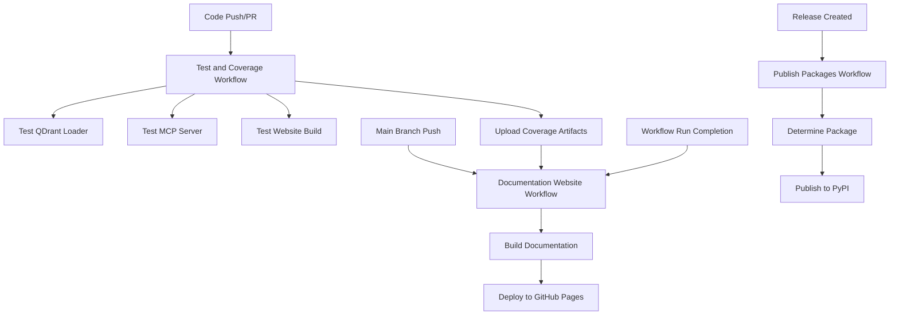

# CI/CD Integration Workflow

This comprehensive guide shows how to implement automated documentation pipelines and continuous knowledge base updates using QDrant Loader in CI/CD environments. This workflow is based on the actual CI/CD pipelines used in the QDrant Loader project itself, providing real-world examples and best practices.

## 🎯 Overview

The QDrant Loader project uses a sophisticated CI/CD pipeline with three main workflows:

1. **Test and Coverage** - Automated testing for all components
2. **Documentation Website** - Automated documentation deployment
3. **Package Publishing** - Automated PyPI releases

This workflow ensures code quality, documentation accuracy, and seamless deployments while maintaining up-to-date knowledge bases.

### Workflow Benefits

```text
🔄 Automated Testing - Comprehensive test coverage for all components
🚀 Documentation Deploy - Automatic GitHub Pages deployment with manual override
📦 Package Publishing - Automated PyPI releases with proper versioning
🔍 Quality Assurance - Multi-package testing with coverage reports
📊 Artifact Management - Test results and coverage artifacts with intelligent discovery
🛡️ Security & Permissions - Minimal required permissions for each job
⚡ Manual Deployment - On-demand documentation deployment for hotfixes
🔧 Force Deploy Option - Emergency deployment without waiting for test artifacts
```

## 🏗️ Architecture Overview



## 📋 Prerequisites

### Repository Setup

- **GitHub repository** with proper branch protection
- **GitHub Pages** enabled for documentation
- **PyPI accounts** for package publishing
- **GitHub Secrets** configured for external services

### Required Secrets

```bash
# QDrant Configuration
QDRANT_URL=your_qdrant_instance_url
QDRANT_API_KEY=your_qdrant_api_key
QDRANT_COLLECTION_NAME=your_test_collection_name

# LLM Configuration
LLM_API_KEY=your_openai_api_key
OPENAI_API_KEY=your_openai_api_key  # Legacy support

# Optional: Data Source Credentials
REPO_TOKEN=your_github_token
CONFLUENCE_TOKEN=your_confluence_token
CONFLUENCE_EMAIL=your_confluence_email
JIRA_TOKEN=your_jira_token
JIRA_EMAIL=your_jira_email
```

## 🚀 Actual CI/CD Implementation

### Workflow 1: Test and Coverage

The test workflow runs on every push and pull request, ensuring code quality across all components.

```yaml
# .github/workflows/test.yml
name: Test and Coverage

on:
  push:
    branches: [ main, develop, feature/*, bugfix/*, release/* ]
  pull_request:
    branches: [ main, develop, feature/*, bugfix/*, release/* ]

permissions:
  contents: read
  actions: read

concurrency:
  group: "test-${{ github.ref }}"
  cancel-in-progress: true

jobs:
  test-loader:
    name: Test QDrant Loader
    runs-on: ubuntu-latest
    steps:
      - uses: actions/checkout@v4
      - name: Set up Python
        uses: actions/setup-python@v5
        with:
          python-version: '3.12'
      - name: Install system dependencies
        run: |
          # Install ffmpeg for MarkItDown audio processing
          sudo apt-get update
          sudo apt-get install -y ffmpeg
      - name: Install dependencies
        run: |
          python -m pip install --upgrade pip
          pip install -e packages/qdrant-loader[dev]
      - name: Create test configuration
        run: |
          cd packages/qdrant-loader
          cp tests/.env.test.template tests/.env.test
          cp tests/config.test.template.yaml tests/config.test.yaml
          # Configure with GitHub secrets
          sed -i "s|QDRANT_URL=.*|QDRANT_URL=${{ secrets.QDRANT_URL }}|g" tests/.env.test
          sed -i "s|QDRANT_API_KEY=.*|QDRANT_API_KEY=${{ secrets.QDRANT_API_KEY }}|g" tests/.env.test
          sed -i "s|LLM_API_KEY=.*|LLM_API_KEY=${{ secrets.LLM_API_KEY }}|g" tests/.env.test
          sed -i "s|OPENAI_API_KEY=.*|OPENAI_API_KEY=${{ secrets.OPENAI_API_KEY }}|g" tests/.env.test
      - name: Run tests with coverage
        run: |
          cd packages/qdrant-loader
          python -m pytest tests/ --cov=src --cov-report=xml:../../coverage-loader.xml --cov-report=html:../../htmlcov-loader -v
      - name: Upload coverage artifacts
        uses: actions/upload-artifact@v4
        with:
          name: coverage-loader-${{ github.run_id }}
          path: |
            htmlcov-loader
            coverage-loader.xml
          retention-days: 30
```

### Workflow 2: Documentation Website

The documentation workflow builds and deploys the website to GitHub Pages, integrating test results and coverage reports.

```yaml
# .github/workflows/docs.yml
name: Documentation Website

on:
  push:
    branches: [ main ]
    paths:
      - 'docs/**'
      - 'README.md'
      - 'RELEASE_NOTES.md'
      - 'packages/*/README.md'
      - 'website/**'
      - '.github/workflows/docs.yml'
  workflow_run:
    workflows: ["Test and Coverage"]
    types:
      - completed
    branches: [ main ]
  workflow_dispatch:
    inputs:
      force_deploy:
        description: 'Force deployment even without recent test artifacts'
        required: false
        default: false
        type: boolean

permissions:
  contents: read
  pages: write
  id-token: write
  actions: read

concurrency:
  group: "docs-${{ github.ref }}"
  cancel-in-progress: false

jobs:
  build-docs:
    name: Build Documentation Website
    runs-on: ubuntu-latest
    steps:
      - uses: actions/checkout@v4
      - name: Set up Python
        uses: actions/setup-python@v5
        with:
          python-version: '3.12'
      - name: Install dependencies
        run: |
          python -m pip install --upgrade pip
          pip install -e ".[docs]"
      - name: Generate favicons
        run: |
          python website/assets/generate_favicons.py
      - name: Build website using templates
        run: |
          echo "🚀 Building website using template system"
          python website/build.py \
            --output site \
            --templates website/templates \
            --coverage-artifacts coverage-artifacts/ \
            --test-results test-results/ \
            --base-url ""
      - name: Setup Pages
        uses: actions/configure-pages@v4
      - name: Upload site artifact
        uses: actions/upload-pages-artifact@v3
        with:
          path: site

  deploy:
    name: Deploy to GitHub Pages
    runs-on: ubuntu-latest
    needs: build-docs
    if: github.ref == 'refs/heads/main'
    environment:
      name: github-pages
      url: ${{ steps.deployment.outputs.page_url }}
    steps:
      - name: Deploy to GitHub Pages
        id: deployment
        uses: actions/deploy-pages@v4
```

### Workflow 3: Package Publishing

The publishing workflow automatically publishes packages to PyPI when releases are created.

```yaml
# .github/workflows/publish.yml
name: Publish Packages to PyPI

on:
  release:
    types: [created]

permissions:
  contents: read

jobs:
  determine-package:
    name: Determine which package to publish
    runs-on: ubuntu-latest
    outputs:
      publish-loader: ${{ steps.check.outputs.publish-loader }}
      publish-mcp-server: ${{ steps.check.outputs.publish-mcp-server }}
    steps:
      - name: Check release tag
        id: check
        run: |
          if [[ "${{ github.event.release.tag_name }}" == qdrant-loader-mcp-server-* ]]; then
            echo "publish-loader=false" >> $GITHUB_OUTPUT
            echo "publish-mcp-server=true" >> $GITHUB_OUTPUT
          elif [[ "${{ github.event.release.tag_name }}" == qdrant-loader-* ]]; then
            echo "publish-loader=true" >> $GITHUB_OUTPUT
            echo "publish-mcp-server=false" >> $GITHUB_OUTPUT
          else
            echo "publish-loader=false" >> $GITHUB_OUTPUT
            echo "publish-mcp-server=false" >> $GITHUB_OUTPUT
          fi

  publish-loader:
    name: Publish QDrant Loader to PyPI
    runs-on: ubuntu-latest
    needs: determine-package
    if: needs.determine-package.outputs.publish-loader == 'true'
    environment:
      name: ${{ vars.PYPI_ENVIRONMENT || 'pypi-publish' }}
      url: https://pypi.org/p/qdrant-loader
    permissions:
      id-token: write
    steps:
      - uses: actions/checkout@v4
      - name: Set up Python
        uses: actions/setup-python@v5
        with:
          python-version: "3.12"
      - name: Install dependencies
        run: |
          python -m pip install --upgrade pip
          pip install build twine
      - name: Build loader package
        run: |
          cd packages/qdrant-loader
          python -m build
      - name: Publish loader package to PyPI
        uses: pypa/gh-action-pypi-publish@release/v1
        with:
          packages-dir: packages/qdrant-loader/dist/
```

## 🔧 Implementing Similar Workflows

### Manual Documentation Deployment

The documentation workflow includes a **manual deployment capability** for cases where you need to deploy documentation fixes immediately without waiting for automatic triggers.

#### When to Use Manual Deployment

- **Documentation hotfixes** - Critical documentation errors that need immediate correction
- **Content updates** - Important content changes that should be deployed quickly
- **Testing changes** - Verifying documentation changes in the live environment
- **Emergency updates** - Urgent documentation updates outside normal workflow triggers

#### Manual Deployment Options

##### Option 1: Deploy with Latest Test Artifacts

```bash
# Trigger manual deployment using GitHub CLI
gh workflow run "Documentation Website"

# Or via GitHub web interface:
# 1. Go to Actions tab
# 2. Select "Documentation Website" workflow
# 3. Click "Run workflow"
# 4. Leave "Force deployment" unchecked (default)
```

##### Option 2: Force Deploy Without Test Artifacts

```bash
# Force deployment even without recent test results
gh workflow run "Documentation Website" \
  --field force_deploy=true

# Or via GitHub web interface:
# 1. Go to Actions tab
# 2. Select "Documentation Website" workflow
# 3. Click "Run workflow"
# 4. Check "Force deployment even without recent test artifacts"
```

#### Manual Deployment Workflow Logic

The manual deployment includes intelligent artifact handling:

1. **Artifact Discovery**: Automatically finds the latest successful test run
2. **Graceful Fallback**: Continues without artifacts if `force_deploy=true`
3. **Safety Checks**: Validates critical pages exist before deployment
4. **Status Reporting**: Provides clear feedback about artifact availability

```yaml
# Key features of manual deployment
- name: Get latest test workflow run ID
  if: github.event_name == 'workflow_dispatch'
  run: |
    # Automatically finds latest successful test run
    # Falls back gracefully if force_deploy=true
    # Provides clear status messages
```

#### Best Practices for Manual Deployment

1. **Use Standard Deployment** when possible (waits for test artifacts)
2. **Use Force Deployment** only for:
   - Documentation-only changes
   - Emergency fixes
   - When test pipeline is temporarily broken
3. **Verify deployment** by checking the live site after deployment
4. **Monitor workflow logs** for any deployment issues

### Step 1: Repository Setup

#### 1.1 Directory Structure

```text
your-qdrant-project/
├── .github/
│   └── workflows/
│       ├── test.yml
│       ├── docs.yml
│       └── publish.yml
├── packages/
│   └── your-package/
│       ├── src/
│       ├── tests/
│       └── pyproject.toml
├── docs/
├── website/
└── config.yaml
```

#### 1.2 Required Files

```bash
# Test configuration templates
packages/your-package/tests/.env.test.template
packages/your-package/tests/config.test.template.yaml

# Package configuration
packages/your-package/pyproject.toml

# Documentation configuration
website/build.py
website/templates/
```

### Step 2: Adapting the Workflows

#### 2.1 Customize Test Workflow

```yaml
# Modify for your package structure
- name: Install dependencies
  run: |
    python -m pip install --upgrade pip
    pip install -e packages/your-package[dev]

# Add your specific test requirements
- name: Install system dependencies
  run: |
    sudo apt-get update
    sudo apt-get install -y your-system-deps

# Configure your test environment
- name: Create test configuration
  run: |
    cd packages/your-package
    # Copy and configure your test templates
    cp tests/.env.test.template tests/.env.test
    # Set your specific environment variables
```

#### 2.2 Customize Documentation Workflow

```yaml
# Modify paths for your documentation
on:
  push:
    branches: [ main ]
    paths:
      - 'docs/**'
      - 'your-specific-paths/**'

# Adapt build process
- name: Build your documentation
  run: |
    # Your specific documentation build process
    python your-build-script.py
```

#### 2.3 Customize Publishing Workflow

```yaml
# Modify package detection logic
- name: Check release tag
  run: |
    if [[ "${{ github.event.release.tag_name }}" == your-package-* ]]; then
      echo "publish-package=true" >> $GITHUB_OUTPUT
    fi

# Adapt package paths
- name: Build package
  run: |
    cd packages/your-package
    python -m build
```

### Step 3: Configuration Management

#### 3.1 Environment Variables

```bash
# Required secrets in GitHub repository settings
QDRANT_URL=your_qdrant_instance
QDRANT_API_KEY=your_api_key
LLM_API_KEY=your_openai_key
OPENAI_API_KEY=your_openai_key  # Legacy support

# Optional data source credentials
CONFLUENCE_TOKEN=your_confluence_token
JIRA_TOKEN=your_jira_token
REPO_TOKEN=your_github_token
```

#### 3.2 Test Configuration Templates

```yaml
# tests/config.test.template.yaml
global:
  qdrant:
    collection_name: ${QDRANT_COLLECTION_NAME}
    vector_size: 1536
    distance: Cosine
  openai:
    model: text-embedding-3-small

projects:
  test-project:
    display_name: "Test Project"
    description: "Test configuration"
    collection_name: ${QDRANT_COLLECTION_NAME}
    sources:
      git:
        test-repo:
          base_url: "${REPO_URL}"
          branch: main
          include_paths:
            - "docs/**"
          file_types:
            - ".md"
```

```bash
# tests/.env.test.template
QDRANT_URL=placeholder
QDRANT_API_KEY=placeholder
QDRANT_COLLECTION_NAME=placeholder
LLM_API_KEY=placeholder
OPENAI_API_KEY=placeholder  # Legacy support
STATE_DB_PATH=:memory:

# Optional data sources
REPO_TOKEN=placeholder
CONFLUENCE_TOKEN=placeholder
JIRA_TOKEN=placeholder
```

## 📊 Monitoring and Observability

### Workflow Monitoring

```bash
# Check workflow status
gh workflow list

# View specific workflow runs
gh run list --workflow="Test and Coverage"

# Download artifacts
gh run download <run-id>

# View workflow logs
gh run view <run-id> --log
```

### Coverage Integration

The workflows automatically generate and integrate coverage reports:

1. **Test Coverage**: Generated during test runs
2. **Artifact Upload**: Coverage reports uploaded as artifacts
3. **Website Integration**: Coverage data integrated into documentation site
4. **Historical Tracking**: Coverage trends tracked over time

### Test Result Integration

Test results are automatically processed and displayed:

1. **Status Artifacts**: Test status saved as JSON artifacts
2. **Website Display**: Test results shown on documentation site
3. **Failure Notifications**: Failed tests trigger notifications
4. **Branch Protection**: Tests must pass before merging

## 🔧 Troubleshooting

### Common Issues

1. **Test Failures**

```bash
# Check test logs
gh run view <run-id> --log

# Run tests locally
cd packages/qdrant-loader
python -m pytest tests/ -v
```

1. **Documentation Build Failures**

```bash
# Check build logs
gh run view <run-id> --log

# Test build locally
python website/build.py --output test-site
```

1. **Publishing Failures**

```bash
# Check release tag format
git tag -l

# Verify package build
cd packages/qdrant-loader
python -m build
```

1. **Secret Configuration Issues**

```bash
# Verify secrets are set
gh secret list

# Test with local environment
cp tests/.env.test.template tests/.env.test
# Edit with real values and test locally
```

1. **Manual Deployment Issues**

```bash
# Check if workflow_dispatch is enabled
gh workflow list

# View manual deployment run
gh run list --workflow="Documentation Website"

# Check deployment logs
gh run view <run-id> --log

# Force deploy without artifacts (emergency)
gh workflow run "Documentation Website" --field force_deploy=true

# Verify GitHub Pages is enabled
gh api repos/:owner/:repo/pages
```

### Debugging Commands

```bash
# Local testing with actual CLI commands
qdrant-loader config --workspace .
qdrant-loader config --workspace .
qdrant-loader config --workspace .

# Check workflow artifacts
gh run download <run-id> --name coverage-loader-<run-id>
gh run download <run-id> --name test-status-<run-id>

# Monitor workflow execution
gh run watch <run-id>
```

## 📚 Best Practices

### 1. Workflow Design

- **Minimal Permissions**: Each job has only required permissions
- **Concurrency Control**: Prevent conflicting workflow runs
- **Artifact Management**: Proper retention and cleanup policies
- **Error Handling**: Graceful failure handling with continue-on-error

### 2. Testing Strategy

- **Multi-Package Testing**: Separate jobs for each package
- **System Dependencies**: Install required system packages
- **Environment Isolation**: Use templates for test configuration
- **Coverage Tracking**: Comprehensive coverage reporting

### 3. Documentation Automation

- **Trigger Optimization**: Build only when documentation changes
- **Artifact Integration**: Include test results and coverage
- **Build Verification**: Validate critical pages exist
- **Deployment Safety**: Use GitHub Pages environments

### 4. Release Management

- **Tag-Based Publishing**: Automatic package detection from tags
- **Environment Protection**: Use PyPI environments for security
- **Build Verification**: Test package builds before publishing
- **Trusted Publishing**: Use OIDC for secure PyPI publishing

## 📚 Additional Resources

- [GitHub Actions Documentation](https://docs.github.com/en/actions)
- [PyPI Trusted Publishing](https://docs.pypi.org/trusted-publishers/)
- [GitHub Pages Deployment](https://docs.github.com/en/pages)
- [QDrant Loader CLI Reference](../cli-reference/README.md)
- [Configuration Guide](../configuration/README.md)
