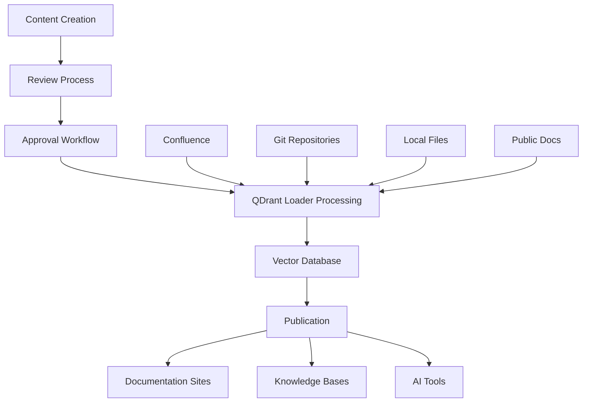

# Content Management Workflow

This comprehensive guide shows how to implement streamlined content management workflows for documentation teams, content creators, and knowledge managers. Whether you're managing a documentation site, internal knowledge base, or content publishing pipeline, this workflow provides practical solutions for content creation, review, publishing, and maintenance using QDrant Loader's actual capabilities.

## 🎯 Overview

The content management workflow focuses on creating efficient processes for content lifecycle management, from initial creation through publication and ongoing maintenance. This workflow is essential for organizations that need to maintain high-quality, up-to-date content across multiple sources and formats.

### Workflow Benefits

```text
📝 Streamlined Publishing - Efficient content creation to publication
🔍 Quality Control - Automated review and validation processes
🔄 Content Synchronization - Multi-source content coordination
📊 Analytics & Insights - Content performance and usage tracking
🤝 Collaborative Editing - Team-based content development
```

## 🏗️ Architecture Overview



## 📋 Prerequisites

### Required Tools

- **Content Management System** (Confluence, Git repositories, etc.)
- **Version Control** (Git for documentation)
- **QDrant instance** (local or cloud)
- **OpenAI API key** for embeddings
- **CI/CD platform** for automation

### Content Sources

```text
📚 Documentation Sites - Static site generators, public docs
🏢 Enterprise CMS - Confluence, JIRA
📁 File Systems - Markdown, Word docs, PDFs
🔗 Git Repositories - Code repos, documentation repos
```

## 🚀 Step-by-Step Implementation

### Step 1: Content Source Configuration

#### 1.1 Multi-Project Setup

```yaml
# config.yaml - Multi-project configuration
global:
  qdrant:
    url: "${QDRANT_URL}"
    api_key: "${QDRANT_API_KEY}"
    collection_name: "content_hub"
  embedding:
    endpoint: "https://api.openai.com/v1"
    model: "text-embedding-3-small"
    api_key: "${OPENAI_API_KEY}"
    batch_size: 100
    vector_size: 1536
    tokenizer: "cl100k_base"
    max_tokens_per_request: 8000
    max_tokens_per_chunk: 8000
  chunking:
    chunk_size: 1200
    chunk_overlap: 300
  file_conversion:
    max_file_size: 52428800  # 50MB
    conversion_timeout: 300
    markitdown:
      enable_llm_descriptions: false
      llm_model: "gpt-4o"
      llm_endpoint: "https://api.openai.com/v1"
      llm_api_key: "${OPENAI_API_KEY}"
  state_management:
    database_path: "${STATE_DB_PATH}"
    table_prefix: "qdrant_loader_"

# Multi-project configuration
projects:
  # Documentation project
  documentation:
    project_id: "documentation"
    display_name: "Documentation Hub"
    description: "Company documentation and guides"
    sources:
      confluence:
        docs-space:
          base_url: "${CONFLUENCE_URL}"
          deployment_type: "cloud"  # or "data_center"
          space_key: "DOCS"
          email: "${CONFLUENCE_EMAIL}"
          token: "${CONFLUENCE_API_TOKEN}"
          content_types:
            - "page"
            - "blogpost"
          include_labels:
            - "published"
            - "approved"
          exclude_labels:
            - "draft"
            - "archived"
          enable_file_conversion: true
          download_attachments: true
        kb-space:
          base_url: "${CONFLUENCE_URL}"
          deployment_type: "cloud"
          space_key: "KB"
          email: "${CONFLUENCE_EMAIL}"
          token: "${CONFLUENCE_API_TOKEN}"
          content_types:
            - "page"
          include_labels:
            - "knowledge-base"
          enable_file_conversion: true
          download_attachments: true
      git:
        docs-repo:
          base_url: "https://github.com/company/documentation.git"
          branch: "main"
          token: "${GITHUB_TOKEN}"
          include_paths:
            - "content/**/*.md"
            - "docs/**/*.md"
            - "guides/**/*.md"
            - "README.md"
          exclude_paths:
            - "drafts/**"
            - "*.draft.md"
            - "node_modules/**"
          file_types:
            - "*.md"
            - "*.rst"
            - "*.txt"
          max_file_size: 1048576
          depth: 10
          enable_file_conversion: true
      localfile:
        published-content:
          base_url: "file:///content/published"
          include_paths:
            - "**/*.md"
            - "**/*.pdf"
            - "**/*.docx"
          exclude_paths:
            - "**/*.tmp"
            - "**/~*"
          file_types:
            - "*.md"
            - "*.pdf"
            - "*.docx"
            - "*.txt"
          max_file_size: 52428800
          enable_file_conversion: true

  # Knowledge base project
  knowledge-base:
    project_id: "knowledge-base"
    display_name: "Knowledge Base"
    description: "Internal knowledge and procedures"
    sources:
      confluence:
        procedures:
          base_url: "${CONFLUENCE_URL}"
          deployment_type: "cloud"
          space_key: "PROC"
          email: "${CONFLUENCE_EMAIL}"
          token: "${CONFLUENCE_API_TOKEN}"
          content_types:
            - "page"
          include_labels:
            - "procedure"
            - "policy"
          enable_file_conversion: true
          download_attachments: true
      localfile:
        policies:
          base_url: "file:///policies"
          include_paths:
            - "**/*.pdf"
            - "**/*.docx"
          file_types:
            - "*.pdf"
            - "*.docx"
          max_file_size: 52428800
          enable_file_conversion: true
```

#### 1.2 Environment Variables

```bash
# .env - Environment configuration
QDRANT_URL=http://localhost:6333
QDRANT_API_KEY=your_qdrant_api_key
QDRANT_COLLECTION_NAME=content_hub
OPENAI_API_KEY=your_openai_api_key

CONFLUENCE_URL=https://company.atlassian.net
CONFLUENCE_EMAIL=your_email@company.com
CONFLUENCE_API_TOKEN=your_confluence_token

GITHUB_TOKEN=your_github_token
STATE_DB_PATH=./workspace_state.db
```

### Step 2: Content Creation Workflow

#### 2.1 Content Templates

```markdown
<!-- content-template.md -->
---
title: "Content Title"
author: "Author Name"
created_date: "2024-01-15"
content_type: "guide"
status: "draft"
tags: ["tag1", "tag2"]
category: "documentation"
audience: "developers"
review_date: "2024-02-15"
---

# Content Title

## Overview

Brief description of the content and its purpose.

## Prerequisites

- Requirement 1
- Requirement 2

## Main Content

### Section 1

Content here...

### Section 2

Content here...

## Examples

```bash
# Code examples
qdrant-loader init --workspace .
qdrant-loader ingest --workspace . --project documentation
```

## Related Content

- Related Guide 1 - Coming later
- Related Guide 2 - Coming later

## Feedback

For questions or feedback, contact [team@company.com](mailto:team@company.com)

---

**Last Updated**: 2024-01-15

**Next Review**: 2024-02-15

```text

#### 2.2 Content Creation Scripts

```bash
#!/bin/bash
# scripts/create-content.sh - Content creation helper
set -euo pipefail

CONTENT_DIR="${CONTENT_DIR:-./content}"
TEMPLATE_DIR="${TEMPLATE_DIR:-./templates}"

# Function to create new content
create_content() {
    local content_type="$1"
    local title="$2"
    local author="${3:-$(git config user.name)}"
    
    # Sanitize title for filename
    local filename=$(echo "$title" | tr '[:upper:]' '[:lower:]' | sed 's/[^a-z0-9]/-/g' | sed 's/--*/-/g' | sed 's/^-\|-$//g')
    local filepath="$CONTENT_DIR/$content_type/$filename.md"
    
    # Create directory if it doesn't exist
    mkdir -p "$(dirname "$filepath")"
    
    # Copy template and customize
    if [ -f "$TEMPLATE_DIR/$content_type-template.md" ]; then
        cp "$TEMPLATE_DIR/$content_type-template.md" "$filepath"
    else
        cp "$TEMPLATE_DIR/default-template.md" "$filepath"
    fi
    
    # Replace placeholders
    sed -i "s/{{TITLE}}/$title/g" "$filepath"
    sed -i "s/{{AUTHOR}}/$author/g" "$filepath"
    sed -i "s/{{DATE}}/$(date +%Y-%m-%d)/g" "$filepath"
    sed -i "s/{{TYPE}}/$content_type/g" "$filepath"
    
    echo "Created new $content_type: $filepath"
    echo "Next steps:"
    echo "1. Edit the content: $filepath"
    echo "2. Submit for review: ./scripts/submit-review.sh $filepath"
    echo "3. Publish: ./scripts/publish-content.sh $filepath"
}

# Function to list content templates
list_templates() {
    echo "Available content templates:"
    for template in "$TEMPLATE_DIR"/*-template.md; do
        if [ -f "$template" ]; then
            local type=$(basename "$template" -template.md)
            echo " - $type"
        fi
    done
}

# Main function
main() {
    local command="${1:-help}"
    
    case "$command" in
        create)
            if [ $# -lt 3 ]; then
                echo "Usage: $0 create <type> <title> [author]"
                echo "Example: $0 create guide 'Getting Started with API' 'John Doe'"
                exit 1
            fi
            create_content "$2" "$3" "${4:-}"
            ;;
        list)
            list_templates
            ;;
        help|*)
            echo "Content Creation Helper"
            echo ""
            echo "Commands:"
            echo "  create <type> <title> [author]  - Create new content"
            echo "  list                           - List available templates"
            echo "  help                           - Show this help"
            ;;
    esac
}

main "$@"
```

### Step 3: Review and Approval Process

#### 3.1 Content Review Workflow

```bash
#!/bin/bash
# scripts/review-workflow.sh - Content review automation
set -euo pipefail

REVIEW_DIR="${REVIEW_DIR:-./review}"
APPROVED_DIR="${APPROVED_DIR:-./approved}"
WORKSPACE_DIR="${WORKSPACE_DIR:-./workspace}"

# Function to submit content for review
submit_for_review() {
    local filepath="$1"
    local reviewer="${2:-content-team@company.com}"
    
    if [ ! -f "$filepath" ]; then
        echo "Error: File not found: $filepath"
        exit 1
    fi
    
    # Extract metadata
    local title=$(grep "^title:" "$filepath" | cut -d'"' -f2)
    local author=$(grep "^author:" "$filepath" | cut -d'"' -f2)
    
    # Move to review directory
    local review_file="$REVIEW_DIR/$(basename "$filepath")"
    cp "$filepath" "$review_file"
    
    # Update status to review
    sed -i 's/status: "draft"/status: "review"/' "$review_file"
    
    # Create review request
    cat > "$REVIEW_DIR/$(basename "$filepath" .md).review" << EOF
{
  "title": "$title",
  "author": "$author",
  "filepath": "$review_file",
  "reviewer": "$reviewer",
  "submitted_date": "$(date -u +%Y-%m-%dT%H:%M:%SZ)",
  "status": "pending"
}
EOF
    
    echo "Content submitted for review:"
    echo "  Title: $title"
    echo "  Author: $author"
    echo "  Reviewer: $reviewer"
    echo "  File: $review_file"
    
    # Send notification (if configured)
    if command -v mail >/dev/null 2>&1; then
        echo "New content ready for review: $title" | mail -s "Content Review Request" "$reviewer"
    fi
}

# Function to approve content
approve_content() {
    local review_file="$1"
    local approver="${2:-$(git config user.email)}"
    
    if [ ! -f "$review_file" ]; then
        echo "Error: Review file not found: $review_file"
        exit 1
    fi
    
    # Move to approved directory
    local approved_file="$APPROVED_DIR/$(basename "$review_file")"
    cp "$review_file" "$approved_file"
    
    # Update status to approved
    sed -i 's/status: "review"/status: "approved"/' "$approved_file"
    
    # Add approval metadata
    cat >> "$approved_file" << EOF

<!-- Approval Information -->
<!-- Approved by: $approver -->
<!-- Approved date: $(date -u +%Y-%m-%dT%H:%M:%SZ) -->
EOF
    
    echo "Content approved: $(basename "$approved_file")"
    echo "Ready for publishing to QDrant Loader"
}

# Main function
main() {
    local command="${1:-help}"
    
    case "$command" in
        submit)
            if [ $# -lt 2 ]; then
                echo "Usage: $0 submit <filepath> [reviewer]"
                exit 1
            fi
            submit_for_review "$2" "${3:-}"
            ;;
        approve)
            if [ $# -lt 2 ]; then
                echo "Usage: $0 approve <review_file> [approver]"
                exit 1
            fi
            approve_content "$2" "${3:-}"
            ;;
        help|*)
            echo "Content Review Workflow"
            echo ""
            echo "Commands:"
            echo "  submit <file> [reviewer]   - Submit content for review"
            echo "  approve <file> [approver]  - Approve reviewed content"
            echo "  help                       - Show this help"
            ;;
    esac
}

main "$@"
```

### Step 4: Publishing Pipeline

#### 4.1 Content Publishing Script

```bash
#!/bin/bash
# scripts/publish-content.sh - Content publishing automation
set -euo pipefail

WORKSPACE_DIR="${WORKSPACE_DIR:-./workspace}"
APPROVED_DIR="${APPROVED_DIR:-./approved}"

# Function to validate workspace configuration
validate_configuration() {
    echo "Validating workspace configuration..."
    if ! qdrant-loader config --workspace "$WORKSPACE_DIR" >/dev/null 2>&1; then
        echo "❌ Configuration validation failed"
        echo "Please check your config.yaml and .env files"
        return 1
    fi
    echo "✅ Configuration validation passed"
}

# Function to validate projects
validate_projects() {
    echo "Validating project configurations..."
    if ! qdrant-loader project --workspace "$WORKSPACE_DIR" validate; then
        echo "❌ Project validation failed"
        return 1
    fi
    echo "✅ Project validation passed"
}

# Function to initialize QDrant collection
initialize_collection() {
    local force_init="${1:-false}"
    echo "Initializing QDrant collection..."
    
    if [ "$force_init" = "true" ]; then
        qdrant-loader init --workspace "$WORKSPACE_DIR" --force
    else
        qdrant-loader init --workspace "$WORKSPACE_DIR"
    fi
    echo "✅ QDrant collection initialized"
}

# Function to publish content from approved directory
publish_approved_content() {
    echo "Publishing approved content..."
    
    if [ ! -d "$APPROVED_DIR" ] || [ -z "$(ls -A "$APPROVED_DIR" 2>/dev/null)" ]; then
        echo "No approved content found in $APPROVED_DIR"
        return 0
    fi
    
    # Copy approved content to workspace for processing
    local temp_content_dir="$WORKSPACE_DIR/temp_content"
    mkdir -p "$temp_content_dir"
    cp -r "$APPROVED_DIR"/* "$temp_content_dir/"
    
    # Update local file source configuration to include temp content
    echo "Processing approved content through QDrant Loader..."
    
    # Ingest all projects
    qdrant-loader ingest --workspace "$WORKSPACE_DIR"
    
    # Clean up temporary content
    rm -rf "$temp_content_dir"
    
    echo "✅ Content publishing completed"
}

# Function to publish specific project
publish_project() {
    local project_id="$1"
    echo "Publishing project: $project_id"
    
    # Validate specific project
    if ! qdrant-loader project --workspace "$WORKSPACE_DIR" validate --project-id "$project_id"; then
        echo "❌ Project validation failed for: $project_id"
        return 1
    fi
    
    # Ingest specific project
    qdrant-loader ingest --workspace "$WORKSPACE_DIR" --project "$project_id"
    
    echo "✅ Project publishing completed: $project_id"
}

# Function to get project status
get_project_status() {
    echo "Getting project status..."
    
    # List all projects
    echo "Available projects:"
    qdrant-loader project --workspace "$WORKSPACE_DIR" list
    
    echo ""
    echo "Project status:"
    qdrant-loader project --workspace "$WORKSPACE_DIR" status
}

# Function to run content quality checks
run_quality_checks() {
    echo "Running content quality checks..."
    
    # Validate configuration
    validate_configuration || return 1
    
    # Validate projects
    validate_projects || return 1
    
    # Check for approved content
    if [ -d "$APPROVED_DIR" ] && [ -n "$(ls -A "$APPROVED_DIR" 2>/dev/null)" ]; then
        echo "✅ Found approved content ready for publishing"
        ls -la "$APPROVED_DIR"
    else
        echo "ℹ️ No approved content found"
    fi
    
    echo "✅ Quality checks completed"
}

# Main function
main() {
    local command="${1:-help}"
    
    case "$command" in
        validate)
            run_quality_checks
            ;;
        init)
            local force="${2:-false}"
            validate_configuration
            initialize_collection "$force"
            ;;
        publish)
            run_quality_checks
            publish_approved_content
            ;;
        project)
            if [ $# -lt 2 ]; then
                echo "Usage: $0 project <project_id>"
                exit 1
            fi
            publish_project "$2"
            ;;
        status)
            get_project_status
            ;;
        help|*)
            echo "Content Publishing Pipeline"
            echo ""
            echo "Commands:"
            echo "  validate            - Run quality checks"
            echo "  init [force]        - Initialize QDrant collection"
            echo "  publish             - Publish approved content"
            echo "  project <id>        - Publish specific project"
            echo "  status              - Show project status"
            echo "  help                - Show this help"
            ;;
    esac
}

main "$@"
```

#### 4.2 CI/CD Integration

```yaml
# .github/workflows/content-pipeline.yml
name: Content Management Pipeline

on:
  push:
    branches: [main]
    paths: ['content/**', 'approved/**']
  pull_request:
    branches: [main]
    paths: ['content/**']
  workflow_dispatch:
    inputs:
      environment:
        description: 'Deployment environment'
        required: true
        default: 'staging'
        type: choice
        options:
          - staging
          - production

jobs:
  quality-check:
    runs-on: ubuntu-latest
    steps:
      - name: Checkout code
        uses: actions/checkout@v4
      - name: Set up Python
        uses: actions/setup-python@v4
        with:
          python-version: '3.11'
      - name: Install QDrant Loader
        run: |
          pip install qdrant-loader
      - name: Validate configuration
        run: |
          qdrant-loader config --workspace .
        env:
          QDRANT_URL: ${{ secrets.QDRANT_URL }}
          QDRANT_API_KEY: ${{ secrets.QDRANT_API_KEY }}
          OPENAI_API_KEY: ${{ secrets.OPENAI_API_KEY }}
      - name: Validate projects
        run: |
          qdrant-loader project validate --workspace .

  deploy-staging:
    needs: quality-check
    runs-on: ubuntu-latest
    if: github.ref == 'refs/heads/main' || github.event_name == 'workflow_dispatch'
    environment: staging
    steps:
      - name: Checkout code
        uses: actions/checkout@v4
      - name: Set up Python
        uses: actions/setup-python@v4
        with:
          python-version: '3.11'
      - name: Install QDrant Loader
        run: |
          pip install qdrant-loader
      - name: Initialize QDrant collection
        run: |
          qdrant-loader init --workspace . --force
        env:
          QDRANT_URL: ${{ secrets.STAGING_QDRANT_URL }}
          QDRANT_API_KEY: ${{ secrets.STAGING_QDRANT_API_KEY }}
          OPENAI_API_KEY: ${{ secrets.OPENAI_API_KEY }}
      - name: Ingest content
        run: |
          qdrant-loader ingest --workspace .
        env:
          QDRANT_URL: ${{ secrets.STAGING_QDRANT_URL }}
          QDRANT_API_KEY: ${{ secrets.STAGING_QDRANT_API_KEY }}
          OPENAI_API_KEY: ${{ secrets.OPENAI_API_KEY }}
          CONFLUENCE_URL: ${{ secrets.CONFLUENCE_URL }}
          CONFLUENCE_EMAIL: ${{ secrets.CONFLUENCE_EMAIL }}
          CONFLUENCE_API_TOKEN: ${{ secrets.CONFLUENCE_API_TOKEN }}
          GITHUB_TOKEN: ${{ secrets.GITHUB_TOKEN }}
      - name: Verify deployment
        run: |
          qdrant-loader project status --workspace .

  deploy-production:
    needs: deploy-staging
    runs-on: ubuntu-latest
    if: github.event.inputs.environment == 'production'
    environment: production
    steps:
      - name: Checkout code
        uses: actions/checkout@v4
      - name: Set up Python
        uses: actions/setup-python@v4
        with:
          python-version: '3.11'
      - name: Install QDrant Loader
        run: |
          pip install qdrant-loader
      - name: Initialize QDrant collection
        run: |
          qdrant-loader init --workspace . --force
        env:
          QDRANT_URL: ${{ secrets.PRODUCTION_QDRANT_URL }}
          QDRANT_API_KEY: ${{ secrets.PRODUCTION_QDRANT_API_KEY }}
          OPENAI_API_KEY: ${{ secrets.OPENAI_API_KEY }}
      - name: Ingest content
        run: |
          qdrant-loader ingest --workspace .
        env:
          QDRANT_URL: ${{ secrets.PRODUCTION_QDRANT_URL }}
          QDRANT_API_KEY: ${{ secrets.PRODUCTION_QDRANT_API_KEY }}
          OPENAI_API_KEY: ${{ secrets.OPENAI_API_KEY }}
          CONFLUENCE_URL: ${{ secrets.CONFLUENCE_URL }}
          CONFLUENCE_EMAIL: ${{ secrets.CONFLUENCE_EMAIL }}
          CONFLUENCE_API_TOKEN: ${{ secrets.CONFLUENCE_API_TOKEN }}
          GITHUB_TOKEN: ${{ secrets.GITHUB_TOKEN }}
      - name: Verify production deployment
        run: |
          qdrant-loader project status --workspace .
```

### Step 5: Content Monitoring and Maintenance

#### 5.1 Content Health Monitoring

```bash
#!/bin/bash
# scripts/content-monitoring.sh - Content health monitoring
set -euo pipefail

WORKSPACE_DIR="${WORKSPACE_DIR:-./workspace}"
LOG_FILE="${LOG_FILE:-./logs/content-monitoring.log}"

# Function to log messages
log() {
    local level="$1"
    shift
    echo "[$(date '+%Y-%m-%d %H:%M:%S')] [$level] $*" | tee -a "$LOG_FILE"
}

# Function to check workspace health
check_workspace_health() {
    log "INFO" "Checking workspace health..."
    
    # Check configuration
    if qdrant-loader config --workspace "$WORKSPACE_DIR" >/dev/null 2>&1; then
        log "INFO" "✅ Configuration is valid"
    else
        log "ERROR" "❌ Configuration validation failed"
        return 1
    fi
    
    # Check project configurations
    if qdrant-loader project --workspace "$WORKSPACE_DIR" validate >/dev/null 2>&1; then
        log "INFO" "✅ All projects are valid"
    else
        log "ERROR" "❌ Project validation failed"
        return 1
    fi
    
    log "INFO" "Workspace health check completed"
}

# Function to generate content report
generate_content_report() {
    log "INFO" "Generating content report..."
    
    local report_file="./reports/content-report-$(date +%Y%m%d-%H%M%S).json"
    mkdir -p "$(dirname "$report_file")"
    
    # Get project status
    local project_status=$(qdrant-loader project --workspace "$WORKSPACE_DIR" status --format json 2>/dev/null || echo "[]")
    
    # Create report
    cat > "$report_file" << EOF
{
  "timestamp": "$(date -u +%Y-%m-%dT%H:%M:%SZ)",
  "workspace": "$WORKSPACE_DIR",
  "projects": $project_status,
  "health_status": "healthy"
}
EOF
    
    log "INFO" "Content report generated: $report_file"
    echo "$report_file"
}

# Function to check for stale content
check_stale_content() {
    log "INFO" "Checking for stale content..."
    
    # This is a placeholder for stale content detection
    # In a real implementation, you would check modification dates
    # and compare with last ingestion times
    local stale_files=()
    
    # Check for files older than 30 days that haven't been updated
    while IFS= read -r -d '' file; do
        if [ -f "$file" ] && [ "$(find "$file" -mtime +30 -print)" ]; then
            stale_files+=("$file")
        fi
    done < <(find "$WORKSPACE_DIR" -name "*.md" -print0 2>/dev/null)
    
    if [ ${#stale_files[@]} -gt 0 ]; then
        log "WARN" "Found ${#stale_files[@]} potentially stale files"
        for file in "${stale_files[@]}"; do
            log "WARN" "  - $file"
        done
    else
        log "INFO" "✅ No stale content detected"
    fi
}

# Function to run maintenance tasks
run_maintenance() {
    log "INFO" "Running content maintenance tasks..."
    
    # Check workspace health
    check_workspace_health || return 1
    
    # Check for stale content
    check_stale_content
    
    # Generate report
    generate_content_report
    
    log "INFO" "Maintenance tasks completed"
}

# Main function
main() {
    local command="${1:-help}"
    
    case "$command" in
        health)
            check_workspace_health
            ;;
        report)
            generate_content_report
            ;;
        stale)
            check_stale_content
            ;;
        maintenance)
            run_maintenance
            ;;
        help|*)
            echo "Content Monitoring and Maintenance"
            echo ""
            echo "Commands:"
            echo "  health       - Check workspace health"
            echo "  report       - Generate content report"
            echo "  stale        - Check for stale content"
            echo "  maintenance  - Run all maintenance tasks"
            echo "  help         - Show this help"
            ;;
    esac
}

main "$@"
```

## 🔧 Advanced Configuration

### Multi-Environment Setup

```yaml
# config.staging.yaml
global:
  qdrant:
    url: "${STAGING_QDRANT_URL}"
    api_key: "${STAGING_QDRANT_API_KEY}"
    collection_name: "content_staging"
  embedding:
    endpoint: "https://api.openai.com/v1"
    model: "text-embedding-3-small"
    api_key: "${OPENAI_API_KEY}"

projects:
  documentation:
    project_id: "documentation"
    display_name: "Documentation (Staging)"
    description: "Staging environment for documentation"
    sources:
      # Same source configuration as production
      # but potentially with different branches or spaces
```

```yaml
# config.production.yaml
global:
  qdrant:
    url: "${PRODUCTION_QDRANT_URL}"
    api_key: "${PRODUCTION_QDRANT_API_KEY}"
    collection_name: "content_production"
  embedding:
    endpoint: "https://api.openai.com/v1"
    model: "text-embedding-3-small"
    api_key: "${OPENAI_API_KEY}"

projects:
  documentation:
    project_id: "documentation"
    display_name: "Documentation (Production)"
    description: "Production documentation"
    sources:
      # Production source configuration
```

## 📊 Workflow Metrics and Analytics

### Content Performance Tracking

```bash
#!/bin/bash
# scripts/content-analytics.sh - Content performance analytics
set -euo pipefail

WORKSPACE_DIR="${WORKSPACE_DIR:-./workspace}"

# Function to get project statistics
get_project_stats() {
    echo "Project Statistics:"
    echo "==================="
    
    # List all projects with status
    qdrant-loader project --workspace "$WORKSPACE_DIR" list
    
    echo ""
    echo "Detailed Status:"
    echo "================"
    qdrant-loader project --workspace "$WORKSPACE_DIR" status
}

# Function to generate usage report
generate_usage_report() {
    local output_file="${1:-./reports/usage-report-$(date +%Y%m%d).json}"
    mkdir -p "$(dirname "$output_file")"
    
    # Get project status in JSON format
    local project_data=$(qdrant-loader project --workspace "$WORKSPACE_DIR" status --format json 2>/dev/null || echo "[]")
    
    # Create usage report
    cat > "$output_file" << EOF
{
  "report_date": "$(date -u +%Y-%m-%dT%H:%M:%SZ)",
  "workspace": "$WORKSPACE_DIR",
  "projects": $project_data,
  "summary": {
    "total_projects": $(echo "$project_data" | jq 'length' 2>/dev/null || echo "0"),
    "report_generated": "$(date -u +%Y-%m-%dT%H:%M:%SZ)"
  }
}
EOF
    
    echo "Usage report generated: $output_file"
}

# Main function
main() {
    local command="${1:-help}"
    
    case "$command" in
        stats)
            get_project_stats
            ;;
        report)
            generate_usage_report "${2:-}"
            ;;
        help|*)
            echo "Content Analytics"
            echo ""
            echo "Commands:"
            echo "  stats            - Show project statistics"
            echo "  report [file]    - Generate usage report"
            echo "  help             - Show this help"
            ;;
    esac
}

main "$@"
```

## 🚀 Quick Start Guide

### 1. Initial Setup

```bash
# Create workspace directory
mkdir content-management-workspace
cd content-management-workspace

# Download configuration templates
curl -o config.yaml https://raw.githubusercontent.com/martin-papy/qdrant-loader/main/packages/qdrant-loader/conf/config.template.yaml
curl -o .env https://raw.githubusercontent.com/martin-papy/qdrant-loader/main/packages/qdrant-loader/conf/.env.template

# Edit configuration files with your settings
# Update config.yaml with your projects and sources
# Update .env with your API keys and URLs
```

### 2. Validate Configuration

```bash
# Validate workspace configuration
qdrant-loader config --workspace .

# Validate project configurations
qdrant-loader project validate --workspace .
```

### 3. Initialize and Ingest

```bash
# Initialize QDrant collection
qdrant-loader init --workspace .

# Ingest all content
qdrant-loader ingest --workspace .

# Check status
qdrant-loader project status --workspace .
```

### 4. Set Up MCP Server

```bash
# Start MCP server for AI tool integration
mcp-qdrant-loader
```

## 📋 Best Practices

### Content Organization

1. **Use consistent metadata** across all content types
2. **Implement content templates** for standardization
3. **Establish review workflows** before publishing
4. **Monitor content freshness** and update regularly
5. **Use project-based organization** for better management

### Technical Implementation

1. **Use workspace mode** for better organization
2. **Implement CI/CD pipelines** for automation
3. **Monitor system health** regularly
4. **Back up configurations** and content
5. **Use environment-specific configurations** for staging/production

### Team Collaboration

1. **Define clear roles** and responsibilities
2. **Establish content standards** and guidelines
3. **Use version control** for content tracking
4. **Implement approval workflows** for quality control
5. **Provide training** on tools and processes

---

This content management workflow provides a comprehensive foundation for managing content lifecycle with QDrant Loader. Adapt the scripts and configurations to match your specific organizational needs and technical requirements.
