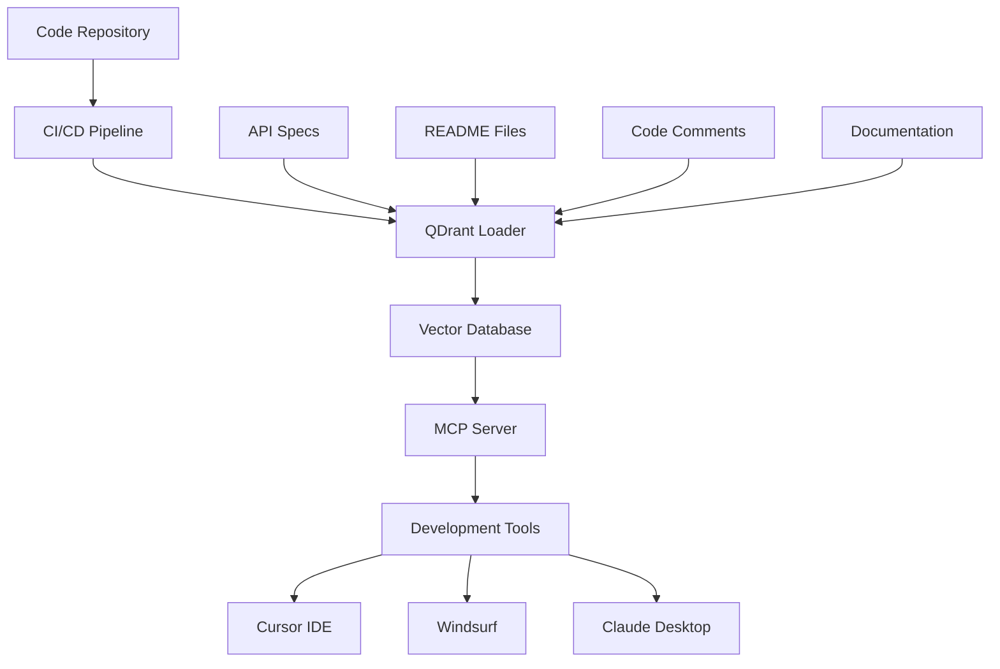

# Development Workflow

This comprehensive guide shows how to implement automated documentation workflows for development teams. Whether you're maintaining code documentation, API references, or development guides, this workflow provides step-by-step instructions for creating a seamless, automated documentation system using QDrant Loader's actual capabilities.

## 🎯 Overview

The development workflow focuses on keeping documentation synchronized with code changes, providing developers with up-to-date information, and integrating documentation into the development process. This workflow is essential for maintaining high-quality, current documentation in fast-moving development environments.

### Workflow Benefits

```
🔄 Automated Updates     - Documentation stays current with code
🚀 Developer Productivity - Faster access to relevant information
🔍 Better Discoverability - AI-powered search for code and docs
📈 Reduced Maintenance   - Minimal manual documentation overhead
🤝 Team Collaboration   - Shared knowledge base across teams
```

## 🏗️ Architecture Overview



## 📋 Prerequisites

### Required Tools

- **Git repository** with documentation
- **CI/CD platform** (GitHub Actions, GitLab CI, etc.)
- **QDrant instance** (local or cloud)
- **OpenAI API key** for embeddings
- **Development IDE** (Cursor, Windsurf, VS Code)

### Repository Structure

```
project/
├── docs/                    # Documentation files
│   ├── api/                # API documentation
│   ├── guides/             # Development guides
│   └── README.md           # Main documentation
├── src/                    # Source code
│   ├── components/         # Code with comments
│   └── api/               # API definitions
├── .github/workflows/      # CI/CD workflows
├── config.yaml            # QDrant Loader config
├── .env                   # Environment variables
└── README.md              # Project overview
```

## 🚀 Step-by-Step Implementation

### Step 1: Repository Setup

#### 1.1 Initialize QDrant Loader Configuration

```bash
# Navigate to your project root
cd /path/to/your/project

# Download configuration templates
curl -o config.yaml https://raw.githubusercontent.com/martin-papy/qdrant-loader/main/packages/qdrant-loader/conf/config.template.yaml
curl -o .env https://raw.githubusercontent.com/martin-papy/qdrant-loader/main/packages/qdrant-loader/conf/.env.template

# Edit configuration files with your settings
```

#### 1.2 Configure Data Sources

```yaml
# config.yaml - Multi-project configuration for development
global_config:
  qdrant:
    url: "${QDRANT_URL}"
    api_key: "${QDRANT_API_KEY}"
    collection_name: "dev_docs"

  embedding:
    endpoint: "https://api.openai.com/v1"
    model: "text-embedding-3-small"
    api_key: "${OPENAI_API_KEY}"
    batch_size: 100
    vector_size: 1536
    tokenizer: "cl100k_base"
    max_tokens_per_request: 8000
    max_tokens_per_chunk: 8000

  chunking:
    chunk_size: 1500
    chunk_overlap: 200

  file_conversion:
    max_file_size: 52428800  # 50MB
    conversion_timeout: 300
    markitdown:
      enable_llm_descriptions: false
      llm_model: "gpt-4o"
      llm_endpoint: "https://api.openai.com/v1"
      llm_api_key: "${OPENAI_API_KEY}"

  state_management:
    database_path: "${STATE_DB_PATH}"
    table_prefix: "qdrant_loader_"

# Multi-project configuration
projects:
  # Main documentation project
  documentation:
    project_id: "documentation"
    display_name: "Project Documentation"
    description: "Main project documentation and guides"
    
    sources:
      git:
        main-docs:
          base_url: "."  # Current repository
          branch: "main"
          token: "${GITHUB_TOKEN}"  # Optional for private repos
          include_paths:
            - "docs/**/*.md"
            - "README.md"
            - "CONTRIBUTING.md"
            - "CHANGELOG.md"
          exclude_paths:
            - "node_modules/**"
            - "__pycache__/**"
            - ".git/**"
            - "*.log"
          file_types:
            - "*.md"
            - "*.rst"
            - "*.txt"
          max_file_size: 1048576
          depth: 10
          enable_file_conversion: true

  # Code documentation project
  code-docs:
    project_id: "code-docs"
    display_name: "Code Documentation"
    description: "Source code and API documentation"
    
    sources:
      git:
        source-code:
          base_url: "."  # Current repository
          branch: "main"
          token: "${GITHUB_TOKEN}"  # Optional for private repos
          include_paths:
            - "src/**/*.py"
            - "src/**/*.js"
            - "src/**/*.ts"
            - "src/**/*.java"
            - "src/**/*.go"
            - "api/**/*.yaml"
            - "api/**/*.json"
            - "openapi.yaml"
            - "swagger.json"
          exclude_paths:
            - "src/test/**"
            - "src/**/*.test.*"
            - "src/**/*.spec.*"
            - "node_modules/**"
            - "__pycache__/**"
            - "*.pyc"
            - "*.log"
          file_types:
            - "*.py"
            - "*.js"
            - "*.ts"
            - "*.java"
            - "*.go"
            - "*.yaml"
            - "*.yml"
            - "*.json"
          max_file_size: 1048576
          depth: 10
          enable_file_conversion: true

  # Local development files
  local-docs:
    project_id: "local-docs"
    display_name: "Local Documentation"
    description: "Local documentation files and notes"
    
    sources:
      localfile:
        dev-notes:
          base_url: "file://./dev-notes"
          include_paths:
            - "**/*.md"
            - "**/*.txt"
          exclude_paths:
            - "**/*.tmp"
            - "**/~*"
          file_types:
            - "*.md"
            - "*.txt"
          max_file_size: 1048576
          enable_file_conversion: true
```

#### 1.3 Set Up Environment Variables

```bash
# .env file (for local development)
QDRANT_URL=http://localhost:6333
QDRANT_API_KEY=your-qdrant-api-key
QDRANT_COLLECTION_NAME=dev_docs

OPENAI_API_KEY=your-openai-api-key

GITHUB_TOKEN=your-github-token  # Optional for private repos

STATE_DB_PATH=./workspace_state.db

# For production, use your CI/CD platform's secret management
```

### Step 2: Local Development Setup

#### 2.1 Install and Configure QDrant Loader

```bash
# Install QDrant Loader
pip install qdrant-loader

# Validate configuration
qdrant-loader --workspace . config

# Validate projects
qdrant-loader project --workspace . validate
```

#### 2.2 Initial Data Load

```bash
# Initialize QDrant collection
qdrant-loader --workspace . init

# Load documentation for the first time
qdrant-loader --workspace . ingest

# Check status
qdrant-loader project --workspace . status

# Start MCP server for development
mcp-qdrant-loader
```

#### 2.3 Configure Development IDE

**For Cursor IDE:**

```json
// .cursor/mcp_settings.json
{
  "mcpServers": {
    "qdrant-loader": {
      "command": "mcp-qdrant-loader",
      "env": {
        "QDRANT_URL": "http://localhost:6333",
        "QDRANT_API_KEY": "your-api-key",
        "OPENAI_API_KEY": "your-openai-api-key"
      }
    }
  }
}
```

**For Claude Desktop:**

```json
// claude_desktop_config.json
{
  "mcpServers": {
    "qdrant-loader": {
      "command": "mcp-qdrant-loader",
      "env": {
        "QDRANT_URL": "http://localhost:6333",
        "QDRANT_API_KEY": "your-api-key",
        "OPENAI_API_KEY": "your-openai-api-key"
      }
    }
  }
}
```

### Step 3: CI/CD Integration

#### 3.1 GitHub Actions Workflow

```yaml
# .github/workflows/docs-update.yml
name: Documentation Update

on:
  push:
    branches: [main, develop]
    paths: 
      - 'docs/**'
      - 'src/**'
      - 'api/**'
      - 'README.md'
      - 'config.yaml'
  pull_request:
    branches: [main]
    paths:
      - 'docs/**'
      - 'src/**'
      - 'api/**'
  workflow_dispatch:

jobs:
  validate-config:
    runs-on: ubuntu-latest
    steps:
      - name: Checkout code
        uses: actions/checkout@v4

      - name: Set up Python
        uses: actions/setup-python@v4
        with:
          python-version: '3.11'

      - name: Install QDrant Loader
        run: |
          pip install qdrant-loader

      - name: Validate configuration
        run: |
          qdrant-loader --workspace . config
        env:
          QDRANT_URL: ${{ secrets.QDRANT_URL }}
          QDRANT_API_KEY: ${{ secrets.QDRANT_API_KEY }}
          OPENAI_API_KEY: ${{ secrets.OPENAI_API_KEY }}

      - name: Validate projects
        run: |
          qdrant-loader project --workspace . validate

  update-docs:
    needs: validate-config
    runs-on: ubuntu-latest
    if: github.ref == 'refs/heads/main'
    steps:
      - name: Checkout code
        uses: actions/checkout@v4

      - name: Set up Python
        uses: actions/setup-python@v4
        with:
          python-version: '3.11'

      - name: Install QDrant Loader
        run: |
          pip install qdrant-loader

      - name: Initialize QDrant collection
        run: |
          qdrant-loader --workspace . init --force
        env:
          QDRANT_URL: ${{ secrets.QDRANT_URL }}
          QDRANT_API_KEY: ${{ secrets.QDRANT_API_KEY }}
          OPENAI_API_KEY: ${{ secrets.OPENAI_API_KEY }}

      - name: Update documentation
        run: |
          qdrant-loader --workspace . ingest
        env:
          QDRANT_URL: ${{ secrets.QDRANT_URL }}
          QDRANT_API_KEY: ${{ secrets.QDRANT_API_KEY }}
          OPENAI_API_KEY: ${{ secrets.OPENAI_API_KEY }}
          GITHUB_TOKEN: ${{ secrets.GITHUB_TOKEN }}

      - name: Verify update
        run: |
          qdrant-loader project --workspace . status

  test-search:
    needs: update-docs
    runs-on: ubuntu-latest
    if: github.ref == 'refs/heads/main'
    steps:
      - name: Checkout code
        uses: actions/checkout@v4

      - name: Set up Python
        uses: actions/setup-python@v4
        with:
          python-version: '3.11'

      - name: Install QDrant Loader MCP Server
        run: |
          pip install qdrant-loader-mcp-server

      - name: Test MCP server
        run: |
          # Test that MCP server can start
          timeout 10s mcp-qdrant-loader || true
        env:
          QDRANT_URL: ${{ secrets.QDRANT_URL }}
          QDRANT_API_KEY: ${{ secrets.QDRANT_API_KEY }}
          OPENAI_API_KEY: ${{ secrets.OPENAI_API_KEY }}
```

#### 3.2 GitLab CI Configuration

```yaml
# .gitlab-ci.yml
stages:
  - validate
  - update
  - test

variables:
  PIP_CACHE_DIR: "$CI_PROJECT_DIR/.cache/pip"

cache:
  paths:
    - .cache/pip/

validate-config:
  stage: validate
  image: python:3.11
  script:
    - pip install qdrant-loader
    - qdrant-loader --workspace . config
    - qdrant-loader project --workspace . validate
  only:
    changes:
      - docs/**/*
      - src/**/*
      - api/**/*
      - config.yaml
      - .env

update-documentation:
  stage: update
  image: python:3.11
  script:
    - pip install qdrant-loader
    - qdrant-loader --workspace . init --force
    - qdrant-loader --workspace . ingest
    - qdrant-loader project --workspace . status
  only:
    - main
  environment:
    name: production

test-mcp-server:
  stage: test
  image: python:3.11
  script:
    - pip install qdrant-loader-mcp-server
    - timeout 10s mcp-qdrant-loader || true
  only:
    - main
```

### Step 4: Development Scripts

#### 4.1 Setup Script

```bash
#!/bin/bash
# scripts/setup-dev-docs.sh - Development documentation setup

set -euo pipefail

WORKSPACE_DIR="${WORKSPACE_DIR:-$(pwd)}"

echo "Setting up development documentation workflow..."

# Check if QDrant Loader is installed
if ! command -v qdrant-loader >/dev/null 2>&1; then
    echo "Installing QDrant Loader..."
    pip install qdrant-loader
fi

# Check if MCP server is installed
if ! command -v mcp-qdrant-loader >/dev/null 2>&1; then
    echo "Installing QDrant Loader MCP Server..."
    pip install qdrant-loader-mcp-server
fi

# Validate configuration
echo "Validating configuration..."
if ! qdrant-loader --workspace "$WORKSPACE_DIR" config >/dev/null 2>&1; then
    echo "❌ Configuration validation failed"
    echo "Please check your config.yaml and .env files"
    exit 1
fi

echo "✅ Configuration is valid"

# Validate projects
echo "Validating projects..."
if ! qdrant-loader project --workspace "$WORKSPACE_DIR" validate; then
    echo "❌ Project validation failed"
    exit 1
fi

echo "✅ All projects are valid"

# Initialize QDrant collection
echo "Initializing QDrant collection..."
qdrant-loader --workspace "$WORKSPACE_DIR" init

# Load initial documentation
echo "Loading documentation..."
qdrant-loader --workspace "$WORKSPACE_DIR" ingest

# Check status
echo "Checking project status..."
qdrant-loader project --workspace "$WORKSPACE_DIR" status

echo ""
echo "✅ Development documentation setup completed!"
echo ""
echo "Next steps:"
echo "1. Start MCP server: mcp-qdrant-loader"
echo "2. Configure your IDE with MCP server settings"
echo "3. Update docs: qdrant-loader --workspace . ingest"
```

#### 4.2 Update Script

```bash
#!/bin/bash
# scripts/update-docs.sh - Update documentation

set -euo pipefail

WORKSPACE_DIR="${WORKSPACE_DIR:-$(pwd)}"
PROJECT_ID="${1:-}"

echo "Updating documentation..."

# Validate configuration
if ! qdrant-loader --workspace "$WORKSPACE_DIR" config >/dev/null 2>&1; then
    echo "❌ Configuration validation failed"
    exit 1
fi

# Update specific project or all projects
if [ -n "$PROJECT_ID" ]; then
    echo "Updating project: $PROJECT_ID"
    qdrant-loader --workspace "$WORKSPACE_DIR" ingest --project "$PROJECT_ID"
else
    echo "Updating all projects"
    qdrant-loader --workspace "$WORKSPACE_DIR" ingest
fi

# Show updated status
echo ""
echo "Update completed. Current status:"
qdrant-loader project --workspace "$WORKSPACE_DIR" status

echo ""
echo "✅ Documentation update completed!"
```

#### 4.3 Health Check Script

```bash
#!/bin/bash
# scripts/health-check.sh - Check documentation system health

set -euo pipefail

WORKSPACE_DIR="${WORKSPACE_DIR:-$(pwd)}"

echo "Checking documentation system health..."

# Check configuration
echo "1. Checking configuration..."
if qdrant-loader --workspace "$WORKSPACE_DIR" config >/dev/null 2>&1; then
    echo "   ✅ Configuration is valid"
else
    echo "   ❌ Configuration validation failed"
    exit 1
fi

# Check projects
echo "2. Checking projects..."
if qdrant-loader project --workspace "$WORKSPACE_DIR" validate >/dev/null 2>&1; then
    echo "   ✅ All projects are valid"
else
    echo "   ❌ Project validation failed"
    exit 1
fi

# Check project status
echo "3. Checking project status..."
project_count=$(qdrant-loader project --workspace "$WORKSPACE_DIR" list --format json 2>/dev/null | jq 'length' 2>/dev/null || echo "0")
if [ "$project_count" -gt 0 ]; then
    echo "   ✅ Found $project_count projects"
else
    echo "   ⚠️  No projects found"
fi

# Check MCP server
echo "4. Checking MCP server..."
if command -v mcp-qdrant-loader >/dev/null 2>&1; then
    echo "   ✅ MCP server is installed"
else
    echo "   ⚠️  MCP server not installed"
fi

echo ""
echo "Health check completed!"

# Show current status
echo ""
echo "Current project status:"
qdrant-loader project --workspace "$WORKSPACE_DIR" status
```

### Step 5: IDE Integration

#### 5.1 Cursor IDE Setup

```bash
#!/bin/bash
# scripts/setup-cursor.sh - Setup Cursor IDE integration

set -euo pipefail

CURSOR_CONFIG_DIR="$HOME/.cursor"
MCP_CONFIG_FILE="$CURSOR_CONFIG_DIR/mcp_settings.json"

echo "Setting up Cursor IDE integration..."

# Create Cursor config directory if it doesn't exist
mkdir -p "$CURSOR_CONFIG_DIR"

# Create MCP settings
cat > "$MCP_CONFIG_FILE" << EOF
{
  "mcpServers": {
    "qdrant-loader": {
      "command": "mcp-qdrant-loader",
      "env": {
        "QDRANT_URL": "http://localhost:6333",
        "QDRANT_API_KEY": "",
        "OPENAI_API_KEY": ""
      }
    }
  }
}
EOF

echo "✅ Cursor IDE configuration created: $MCP_CONFIG_FILE"
echo ""
echo "Next steps:"
echo "1. Update the API keys in $MCP_CONFIG_FILE"
echo "2. Start the MCP server: mcp-qdrant-loader"
echo "3. Restart Cursor IDE"
echo "4. The QDrant Loader tools will be available in Cursor"
```

#### 5.2 Claude Desktop Setup

```bash
#!/bin/bash
# scripts/setup-claude-desktop.sh - Setup Claude Desktop integration

set -euo pipefail

# Detect OS and set config path
if [[ "$OSTYPE" == "darwin"* ]]; then
    CONFIG_DIR="$HOME/Library/Application Support/Claude"
elif [[ "$OSTYPE" == "linux-gnu"* ]]; then
    CONFIG_DIR="$HOME/.config/claude"
else
    echo "Unsupported OS: $OSTYPE"
    exit 1
fi

CONFIG_FILE="$CONFIG_DIR/claude_desktop_config.json"

echo "Setting up Claude Desktop integration..."

# Create config directory if it doesn't exist
mkdir -p "$CONFIG_DIR"

# Create Claude Desktop config
cat > "$CONFIG_FILE" << EOF
{
  "mcpServers": {
    "qdrant-loader": {
      "command": "mcp-qdrant-loader",
      "env": {
        "QDRANT_URL": "http://localhost:6333",
        "QDRANT_API_KEY": "",
        "OPENAI_API_KEY": ""
      }
    }
  }
}
EOF

echo "✅ Claude Desktop configuration created: $CONFIG_FILE"
echo ""
echo "Next steps:"
echo "1. Update the API keys in $CONFIG_FILE"
echo "2. Start the MCP server: mcp-qdrant-loader"
echo "3. Restart Claude Desktop"
echo "4. The QDrant Loader tools will be available in Claude Desktop"
```

## 📊 Usage Examples

### Daily Development Tasks

```bash
# Update documentation after code changes
./scripts/update-docs.sh

# Update specific project
./scripts/update-docs.sh documentation

# Check system health
./scripts/health-check.sh

# Check project status
qdrant-loader project --workspace . status
```

### Project-Specific Operations

```bash
# List all projects
qdrant-loader project --workspace . list

# Get detailed status for specific project
qdrant-loader project --workspace . status --project-id documentation

# Validate specific project
qdrant-loader project --workspace . validate --project-id code-docs

# Update only documentation project
qdrant-loader --workspace . ingest --project documentation

# Update only code documentation
qdrant-loader --workspace . ingest --project code-docs
```

### Source-Specific Operations

```bash
# Update only Git sources
qdrant-loader --workspace . ingest --source-type git

# Update specific Git source in documentation project
qdrant-loader --workspace . ingest --project documentation --source-type git --source main-docs

# Update local files only
qdrant-loader --workspace . ingest --source-type localfile
```

## 🔧 Troubleshooting

### Common Issues

**Issue: Configuration validation fails**

```bash
# Check configuration syntax
qdrant-loader --workspace . config

# Validate projects
qdrant-loader project --workspace . validate

# Check environment variables
echo "QDRANT_URL: $QDRANT_URL"
echo "OPENAI_API_KEY: ${OPENAI_API_KEY:0:10}..."
```

**Issue: MCP server not working**

```bash
# Check if MCP server is installed
command -v mcp-qdrant-loader

# Test MCP server startup
mcp-qdrant-loader

# Check environment variables
env | grep -E "(QDRANT|OPENAI)"
```

**Issue: Documentation not updating**

```bash
# Force reinitialize collection
qdrant-loader --workspace . init --force

# Re-ingest all content
qdrant-loader --workspace . ingest

# Check project status
qdrant-loader project --workspace . status
```

### Performance Optimization

```bash
# Check current configuration
qdrant-loader --workspace . config

# Monitor ingestion with debug logging
qdrant-loader --workspace . --log-level DEBUG ingest

# Check project statistics
qdrant-loader project --workspace . status --format json
```

## 📋 Best Practices

### Configuration Management

1. **Use environment variables** for sensitive information
2. **Version control configuration** files (except .env)
3. **Use workspace mode** for better organization
4. **Separate projects** by content type or team
5. **Regular validation** of configuration and projects

### Content Organization

1. **Consistent file structure** across projects
2. **Clear include/exclude patterns** for relevant content
3. **Appropriate chunk sizes** for your content type
4. **Regular content updates** through CI/CD
5. **Monitor content freshness** and relevance

### Development Integration

1. **Automate documentation updates** in CI/CD
2. **Configure IDE integration** for seamless access
3. **Use project-specific updates** for faster iteration
4. **Regular health checks** of the system
5. **Monitor performance** and optimize as needed

---

This development workflow provides a comprehensive foundation for integrating QDrant Loader into your development process. Adapt the scripts and configurations to match your specific project structure and team needs.
