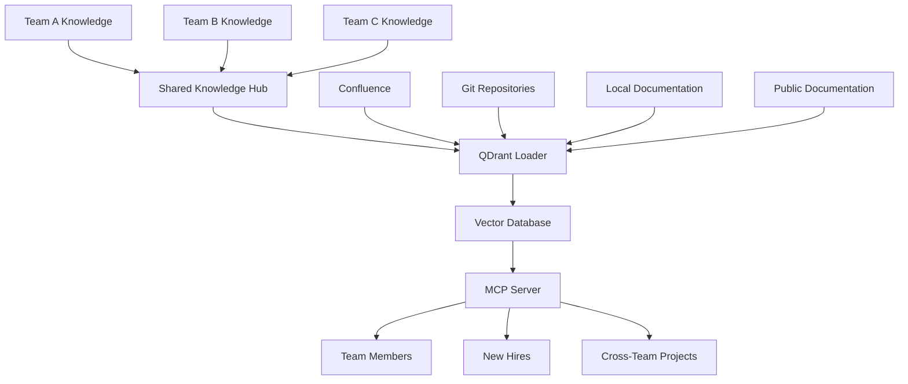

# Team Collaboration Workflow

This comprehensive guide shows how to implement effective team collaboration workflows using QDrant Loader for cross-team knowledge sharing, streamlined onboarding, and collaborative documentation systems. Whether you're managing knowledge across multiple teams, onboarding new team members, or facilitating cross-functional collaboration, this workflow provides practical solutions using QDrant Loader's actual capabilities.

## 🎯 Overview

The team collaboration workflow focuses on breaking down knowledge silos, facilitating information sharing across teams, and creating efficient onboarding processes. This workflow is essential for organizations that need to maintain shared knowledge bases and enable effective collaboration across different departments and teams.

### Workflow Benefits

```text
🤝 Cross-Team Knowledge - Shared understanding across departments
🚀 Faster Onboarding - Streamlined new team member integration
🔍 Knowledge Discovery - Easy access to expertise and information
📊 Collaboration Metrics - Track knowledge sharing effectiveness
🎯 Reduced Silos - Break down departmental barriers
```

## 🏗️ Architecture Overview



## 📋 Prerequisites

### Required Tools

- **Team Communication Platforms** (Slack, Microsoft Teams)
- **Documentation Systems** (Confluence, Git repositories)
- **QDrant instance** (shared across teams)
- **OpenAI API key** for embeddings
- **Development IDEs** (Cursor, Windsurf, VS Code)

### Team Structure Setup

```text
🏢 Organization
├── 📱 Product Team
├── 🔧 Engineering Team
├── 🎨 Design Team
├── 📊 Data Team
├── 🛡️ Security Team
└── 📈 Marketing Team
```

## 🚀 Step-by-Step Implementation

### Step 1: Multi-Team Configuration

#### 1.1 Team-Specific Projects Configuration

```yaml
# config.yaml - Multi-project configuration for team collaboration
global:
  qdrant:
    url: "${QDRANT_URL}"
    api_key: "${QDRANT_API_KEY}"
    collection_name: "team_collaboration"
  embedding:
    endpoint: "https://api.openai.com/v1"
    provider: "openai"
    base_url: "https://api.openai.com/v1"
    api_key: "${LLM_API_KEY}"
    models:
      embeddings: "text-embedding-3-small"
    batch_size: 100
    vector_size: 1536
    tokenizer: "cl100k_base"
    max_tokens_per_request: 8000
    max_tokens_per_chunk: 8000
  chunking:
    chunk_size: 1200
    chunk_overlap: 300
  file_conversion:
    max_file_size: 52428800  # 50MB
    conversion_timeout: 300
    markitdown:
      enable_llm_descriptions: false
      llm_model: "gpt-4o"
      llm_endpoint: "https://api.openai.com/v1"
      llm_api_key: "${LLM_API_KEY}"
  state_management:
    database_path: "${STATE_DB_PATH}"
    table_prefix: "qdrant_loader_"

# Multi-project configuration for different teams
projects:
  # Shared knowledge across all teams
  shared-knowledge:
    project_id: "shared-knowledge"
    display_name: "Shared Knowledge Base"
    description: "Cross-team shared knowledge and documentation"
    sources:
      confluence:
        shared-space:
          base_url: "${CONFLUENCE_URL}"
          deployment_type: "cloud"
          space_key: "SHARED"
          email: "${CONFLUENCE_EMAIL}"
          token: "${CONFLUENCE_API_TOKEN}"
          content_types:
            - "page"
            - "blogpost"
          include_labels:
            - "shared"
            - "cross-team"
            - "onboarding"
          enable_file_conversion: true
          download_attachments: true
      git:
        shared-docs:
          base_url: "https://github.com/company/shared-docs.git"
          branch: "main"
          token: "${GITHUB_TOKEN}"
          include_paths:
            - "docs/**/*.md"
            - "onboarding/**/*.md"
            - "processes/**/*.md"
            - "README.md"
            - "CONTRIBUTING.md"
          exclude_paths:
            - "drafts/**"
            - "*.draft.md"
          file_types:
            - "*.md"
            - "*.rst"
            - "*.txt"
          max_file_size: 1048576
          depth: 10
          enable_file_conversion: true

  # Product team knowledge
  product-team:
    project_id: "product-team"
    display_name: "Product Team Knowledge"
    description: "Product team documentation and processes"
    sources:
      confluence:
        product-space:
          base_url: "${CONFLUENCE_URL}"
          deployment_type: "cloud"
          space_key: "PRODUCT"
          email: "${CONFLUENCE_EMAIL}"
          token: "${CONFLUENCE_API_TOKEN}"
          content_types:
            - "page"
            - "blogpost"
          include_labels:
            - "product"
            - "requirements"
            - "roadmap"
          enable_file_conversion: true
          download_attachments: true
      git:
        product-docs:
          base_url: "https://github.com/company/product-docs.git"
          branch: "main"
          token: "${GITHUB_TOKEN}"
          include_paths:
            - "requirements/**/*.md"
            - "roadmap/**/*.md"
            - "user-stories/**/*.md"
          file_types:
            - "*.md"
            - "*.txt"
          max_file_size: 1048576
          depth: 10
          enable_file_conversion: true

  # Engineering team knowledge
  engineering-team:
    project_id: "engineering-team"
    display_name: "Engineering Team Knowledge"
    description: "Engineering documentation, code, and technical guides"
    sources:
      confluence:
        engineering-space:
          base_url: "${CONFLUENCE_URL}"
          deployment_type: "cloud"
          space_key: "ENG"
          email: "${CONFLUENCE_EMAIL}"
          token: "${CONFLUENCE_API_TOKEN}"
          content_types:
            - "page"
          include_labels:
            - "engineering"
            - "technical"
            - "architecture"
          enable_file_conversion: true
          download_attachments: true
      git:
        engineering-docs:
          base_url: "https://github.com/company/engineering.git"
          branch: "main"
          token: "${GITHUB_TOKEN}"
          include_paths:
            - "docs/**/*.md"
            - "architecture/**/*.md"
            - "api/**/*.yaml"
            - "src/**/*.py"
            - "src/**/*.js"
            - "src/**/*.ts"
            - "README.md"
          exclude_paths:
            - "src/test/**"
            - "src/**/*.test.*"
            - "node_modules/**"
          file_types:
            - "*.md"
            - "*.py"
            - "*.js"
            - "*.ts"
            - "*.yaml"
            - "*.yml"
          max_file_size: 1048576
          depth: 10
          enable_file_conversion: true

  # Design team knowledge
  design-team:
    project_id: "design-team"
    display_name: "Design Team Knowledge"
    description: "Design documentation, guidelines, and assets"
    sources:
      confluence:
        design-space:
          base_url: "${CONFLUENCE_URL}"
          deployment_type: "cloud"
          space_key: "DESIGN"
          email: "${CONFLUENCE_EMAIL}"
          token: "${CONFLUENCE_API_TOKEN}"
          content_types:
            - "page"
            - "blogpost"
          include_labels:
            - "design"
            - "guidelines"
            - "assets"
          enable_file_conversion: true
          download_attachments: true
      localfile:
        design-assets:
          base_url: "file:///design/documentation"
          include_paths:
            - "**/*.md"
            - "**/*.pdf"
            - "**/*.txt"
          exclude_paths:
            - "**/*.tmp"
            - "**/~*"
          file_types:
            - "*.md"
            - "*.pdf"
            - "*.txt"
          max_file_size: 52428800
          enable_file_conversion: true
```

#### 1.2 Environment Variables

```bash
# .env - Environment configuration for team collaboration
QDRANT_URL=http://localhost:6333
QDRANT_API_KEY=your_qdrant_api_key
QDRANT_COLLECTION_NAME=team_collaboration
LLM_API_KEY=your_openai_api_key
OPENAI_API_KEY=your_openai_api_key  # Legacy support

CONFLUENCE_URL=https://company.atlassian.net
CONFLUENCE_EMAIL=your_email@company.com
CONFLUENCE_API_TOKEN=your_confluence_token

GITHUB_TOKEN=your_github_token
STATE_DB_PATH=./workspace_state.db
```

### Step 2: Onboarding Workflow

#### 2.1 New Hire Onboarding Script

```bash
#!/bin/bash
# scripts/onboard-team-member.sh - Team member onboarding automation
set -euo pipefail

WORKSPACE_DIR="${WORKSPACE_DIR:-$(pwd)}"
ONBOARDING_DIR="${ONBOARDING_DIR:-./onboarding}"

# Function to create onboarding package
create_onboarding_package() {
    local new_hire_email="$1"
    local team="$2"
    local mentor="${3:-}"
    
    echo "Creating onboarding package for $new_hire_email (Team: $team)"
    
    # Create personalized onboarding directory
    local onboarding_path="$ONBOARDING_DIR/$new_hire_email"
    mkdir -p "$onboarding_path"
    
    # Generate team-specific knowledge summary
    generate_team_knowledge_summary "$team" "$onboarding_path"
    
    # Create learning path
    create_learning_path "$team" "$onboarding_path"
    
    # Set up AI assistant access
    setup_ai_assistant_access "$new_hire_email" "$team"
    
    # Generate onboarding checklist
    generate_onboarding_checklist "$team" "$onboarding_path"
    
    echo "Onboarding package created: $onboarding_path"
}

# Function to generate team knowledge summary
generate_team_knowledge_summary() {
    local team="$1"
    local output_dir="$2"
    
    echo "Generating knowledge summary for $team team..."
    
    # Get project status to understand available knowledge
    local project_status=$(qdrant-loader config --workspace "$WORKSPACE_DIR" --project-id "${team}-team" --format json 2>/dev/null || echo "[]")
    
    cat > "$output_dir/knowledge-summary.md" << EOF
# $team Team Knowledge Summary

## Welcome to the $team Team!

This summary provides an overview of the knowledge and resources available to help you get started.

## Available Knowledge Sources

### Team-Specific Documentation
- **Project**: ${team}-team
- **Sources**: $(echo "$project_status" | jq -r '.[0].source_count // "N/A"' 2>/dev/null || echo "N/A")
- **Collection**: team_collaboration

### Shared Knowledge Base
- **Project**: shared-knowledge
- **Purpose**: Cross-team documentation and processes
- **Access**: Available to all team members

## Essential Knowledge Areas

### Getting Started
- Team processes and workflows
- Development environment setup
- Communication channels and tools
- Key contacts and resources

### Team Processes
- Daily standup procedures
- Code review process
- Documentation standards
- Meeting schedules

### Tools and Technologies
- Development tools and IDEs
- Collaboration platforms
- Project management tools
- Technical stack overview

### Best Practices
- Coding standards and guidelines
- Documentation practices
- Security considerations
- Quality assurance processes

## How to Search for Information

### Using AI Tools (Cursor, Claude Desktop)
1. Start your AI assistant with QDrant Loader MCP server
2. Ask questions about team processes, tools, or procedures
3. Search across both team-specific and shared knowledge

### Example Queries
- "How do I set up the development environment for the $team team?"
- "What are the code review guidelines?"
- "Who should I contact for access to team tools?"
- "What are the team's current priorities and projects?"

## Next Steps
1. Review this knowledge summary
2. Complete the learning path (see learning-path.md)
3. Follow the onboarding checklist (see onboarding-checklist.md)
4. Set up your AI assistant for easy knowledge access
5. Schedule meetings with team members and mentor

## Resources
- **Learning Path**: ./learning-path.md
- **Onboarding Checklist**: ./onboarding-checklist.md
- **AI Assistant Setup**: ./mcp-config.json
- **Team Contacts**: [See onboarding checklist]

---
**Welcome to the team!** 🎉
EOF
    
    echo "Knowledge summary generated: $output_dir/knowledge-summary.md"
}

# Function to create learning path
create_learning_path() {
    local team="$1"
    local output_dir="$2"
    
    cat > "$output_dir/learning-path.md" << EOF
# $team Team Learning Path

## Week 1: Foundation
- [ ] Read team knowledge summary
- [ ] Review team processes and workflows
- [ ] Set up development environment
- [ ] Meet team members
- [ ] Join team communication channels
- [ ] Set up AI assistant with QDrant Loader MCP server

## Week 2: Deep Dive
- [ ] Study team-specific technologies and tools
- [ ] Review recent projects and codebase
- [ ] Shadow experienced team members
- [ ] Complete first small task or contribution
- [ ] Attend team meetings and standups

## Week 3: Integration
- [ ] Participate actively in team meetings
- [ ] Contribute to ongoing projects
- [ ] Ask questions and seek clarification
- [ ] Document learnings and feedback
- [ ] Start taking on independent tasks

## Week 4: Contribution
- [ ] Take on independent tasks and responsibilities
- [ ] Share knowledge with team members
- [ ] Provide feedback on onboarding process
- [ ] Set goals for next month
- [ ] Complete onboarding review with manager

## Essential Resources

### Team Documentation
Use your AI assistant to search for:
- "Getting started guide for $team team"
- "Development environment setup"
- "Team processes and workflows"
- "Code review guidelines"
- "Project architecture overview"

### Tools and Technologies
Search for information about:
- "Development tools and IDEs"
- "Collaboration platforms"
- "Testing frameworks and practices"
- "Deployment and CI/CD processes"
- "Monitoring and debugging tools"

### Team Contacts
- **Team Lead**: [Contact Info - see onboarding checklist]
- **Mentor**: [Contact Info - see onboarding checklist]
- **Buddy**: [Contact Info - see onboarding checklist]
- **HR Partner**: [Contact Info - see onboarding checklist]
- **IT Support**: [Email] - [Phone]

## Learning Tips
1. **Use AI Assistant**: Ask questions about anything you find in the documentation
2. **Take Notes**: Document what you learn for future reference
3. **Ask Questions**: Don't hesitate to ask team members for clarification
4. **Contribute Early**: Start contributing to documentation and processes
5. **Share Feedback**: Help improve the onboarding process for future hires

---
**Happy Learning!** 📚
EOF
    
    echo "Learning path created: $output_dir/learning-path.md"
}

# Function to setup AI assistant access
setup_ai_assistant_access() {
    local user_email="$1"
    local team="$2"
    
    echo "Setting up AI assistant access for $user_email"
    
    # Create user-specific MCP configuration for Cursor
    cat > "$ONBOARDING_DIR/$user_email/cursor-mcp-config.json" << EOF
{
  "mcpServers": {
    "qdrant-loader": {
      "command": "mcp-qdrant-loader",
      "env": {
        "QDRANT_URL": "${QDRANT_URL}",
        "QDRANT_API_KEY": "${QDRANT_API_KEY}",
        "LLM_API_KEY": "${LLM_API_KEY}",
        "OPENAI_API_KEY": "${OPENAI_API_KEY}"
      }
    }
  }
}
EOF
    
    # Create user-specific MCP configuration for Claude Desktop
    cat > "$ONBOARDING_DIR/$user_email/claude-desktop-config.json" << EOF
{
  "mcpServers": {
    "qdrant-loader": {
      "command": "mcp-qdrant-loader",
      "env": {
        "QDRANT_URL": "${QDRANT_URL}",
        "QDRANT_API_KEY": "${QDRANT_API_KEY}",
        "LLM_API_KEY": "${LLM_API_KEY}",
        "OPENAI_API_KEY": "${OPENAI_API_KEY}"
      }
    }
  }
}
EOF
    
    # Create setup instructions
    cat > "$ONBOARDING_DIR/$user_email/ai-assistant-setup.md" << EOF
# AI Assistant Setup Instructions

## Overview
Your AI assistant can help you search and discover information from the team's knowledge base using QDrant Loader's MCP server.

## Setup for Cursor IDE
1. Copy the configuration to Cursor's MCP settings:
   \`\`\`bash
   cp cursor-mcp-config.json ~/.cursor/mcp_settings.json
   \`\`\`
2. Update the API keys in the configuration file
3. Restart Cursor IDE
4. The QDrant Loader tools will be available in Cursor

## Setup for Claude Desktop
1. Copy the configuration to Claude Desktop's config directory:

   **macOS:**
   \`\`\`bash
   cp claude-desktop-config.json ~/Library/Application\ Support/Claude/claude_desktop_config.json
   \`\`\`

   **Linux:**
   \`\`\`bash
   cp claude-desktop-config.json ~/.config/claude/claude_desktop_config.json
   \`\`\`

2. Update the API keys in the configuration file
3. Restart Claude Desktop
4. The QDrant Loader tools will be available in Claude Desktop

## Using Your AI Assistant

### Example Queries for $team Team
- "Search for getting started documentation for the $team team"
- "Find information about our development environment setup"
- "What are the team's coding standards and best practices?"
- "Show me recent documentation about our project architecture"
- "Find troubleshooting guides for common issues"

### Search Tips
1. **Be Specific**: Include team name or project context in your queries
2. **Use Keywords**: Include relevant technical terms and concepts
3. **Ask Follow-ups**: Ask for clarification or more details on topics
4. **Explore Related**: Ask for related documentation or resources

## Available Projects
- **shared-knowledge**: Cross-team documentation and processes
- **${team}-team**: Team-specific documentation and resources

## Getting Help
If you have issues with the AI assistant setup:
1. Check that all API keys are correctly configured
2. Verify that the MCP server is running: \`mcp-qdrant-loader\`
3. Contact your mentor or team lead for assistance
4. Check the troubleshooting documentation

---
**Happy Searching!** 🔍
EOF
    
    echo "AI assistant configured for $user_email"
}

# Function to generate onboarding checklist
generate_onboarding_checklist() {
    local team="$1"
    local output_dir="$2"
    
    cat > "$output_dir/onboarding-checklist.md" << EOF
# $team Team Onboarding Checklist

## Pre-Start (HR/Manager)
- [ ] Send welcome email with onboarding package
- [ ] Set up accounts and access permissions
- [ ] Assign mentor/buddy
- [ ] Schedule first week meetings
- [ ] Prepare workspace and equipment

## Day 1
- [ ] Welcome meeting with team lead
- [ ] Office/workspace tour (if applicable)
- [ ] IT setup and tool access verification
- [ ] Introduction to team members
- [ ] Review onboarding package and schedule

## Week 1: Foundation
- [ ] Complete knowledge summary review
- [ ] Set up development environment
- [ ] Configure AI assistant with QDrant Loader MCP server
- [ ] Attend team meetings as observer
- [ ] Schedule 1:1s with key team members
- [ ] Join team communication channels
- [ ] Review team documentation and processes

## Week 2: Learning
- [ ] Start first project/task
- [ ] Shadow experienced team member
- [ ] Review team codebase and architecture
- [ ] Ask questions and take notes
- [ ] Participate in code reviews (as observer)
- [ ] Complete environment setup verification

## Week 3: Integration
- [ ] Contribute to team discussions
- [ ] Complete first deliverable
- [ ] Participate actively in team meetings
- [ ] Start independent work
- [ ] Provide initial feedback on onboarding
- [ ] Set 30-day goals with manager

## Month 1 Review
- [ ] Performance check-in with manager
- [ ] Feedback session with mentor
- [ ] Update learning goals and objectives
- [ ] Plan next month objectives
- [ ] Complete onboarding satisfaction survey

## Resources and Contacts

### Key Documents
- **Team Knowledge Summary**: ./knowledge-summary.md
- **Learning Path**: ./learning-path.md
- **AI Assistant Setup**: ./ai-assistant-setup.md

### Important Contacts
- **Manager**: [Name] - [Email] - [Phone]
- **Mentor**: [Name] - [Email] - [Phone]
- **Team Lead**: [Name] - [Email] - [Phone]
- **HR Partner**: [Name] - [Email] - [Phone]
- **IT Support**: [Email] - [Phone]

### Team Communication
- **Slack Channel**: #${team}-team
- **Email List**: ${team}-team@company.com
- **Meeting Calendar**: [Calendar Link]

### Development Resources
- **Code Repository**: [Repository URL]
- **Documentation**: [Documentation URL]
- **Issue Tracker**: [Issue Tracker URL]
- **CI/CD Pipeline**: [Pipeline URL]

## AI Assistant Quick Start
1. Set up MCP server configuration (see ai-assistant-setup.md)
2. Start asking questions about team processes and documentation
3. Use search to find specific information quickly
4. Ask for help when you need clarification

### Example First Queries
- "What do I need to know to get started on the $team team?"
- "How do I set up my development environment?"
- "What are the team's current projects and priorities?"
- "Who should I contact for different types of questions?"

## Success Metrics
By the end of your first month, you should:
- [ ] Feel comfortable with team processes and tools
- [ ] Be able to contribute independently to projects
- [ ] Know who to contact for different types of questions
- [ ] Understand the team's goals and priorities
- [ ] Be able to use the AI assistant effectively for knowledge discovery

---
**Welcome to the $team team!** 🎉

We're excited to have you join us and look forward to your contributions!
EOF
    
    echo "Onboarding checklist created: $output_dir/onboarding-checklist.md"
}

# Main function
main() {
    local command="${1:-help}"
    
    case "$command" in
        onboard)
            if [ $# -lt 3 ]; then
                echo "Usage: $0 onboard <email> <team> [mentor]"
                echo "Example: $0 onboard john.doe@company.com engineering jane.smith@company.com"
                exit 1
            fi
            create_onboarding_package "$2" "$3" "${4:-}"
            ;;
        help|*)
            echo "Team Member Onboarding"
            echo ""
            echo "Commands:"
            echo "  onboard <email> <team> [mentor]  - Create onboarding package"
            echo "  help                             - Show this help"
            echo ""
            echo "Available teams: shared-knowledge, product-team, engineering-team, design-team"
            ;;
    esac
}

main "$@"
```

### Step 3: Knowledge Management and Collaboration

#### 3.1 Daily Collaboration Tasks

```bash
# Update team knowledge base
qdrant-loader ingest --workspace .

# Update specific team project
qdrant-loader ingest --workspace . --project product-team

# Check project status
qdrant-loader config --workspace .

# Validate all projects
qdrant-loader config --workspace .
```

#### 3.2 Weekly Team Operations

```bash
#!/bin/bash
# scripts/weekly-team-sync.sh - Weekly team knowledge synchronization
set -euo pipefail

WORKSPACE_DIR="${WORKSPACE_DIR:-$(pwd)}"

echo "Starting weekly team knowledge synchronization..."

# Update all team projects
echo "Updating shared knowledge..."
qdrant-loader ingest --workspace "$WORKSPACE_DIR" --project shared-knowledge

echo "Updating product team knowledge..."
qdrant-loader ingest --workspace "$WORKSPACE_DIR" --project product-team

echo "Updating engineering team knowledge..."
qdrant-loader ingest --workspace "$WORKSPACE_DIR" --project engineering-team

echo "Updating design team knowledge..."
qdrant-loader ingest --workspace "$WORKSPACE_DIR" --project design-team

# Check status of all projects
echo ""
echo "Project status summary:"
qdrant-loader config --workspace "$WORKSPACE_DIR"

echo ""
echo "✅ Weekly team knowledge synchronization completed!"
```

#### 3.3 Monthly Knowledge Review

```bash
#!/bin/bash
# scripts/monthly-knowledge-review.sh - Monthly knowledge base review
set -euo pipefail

WORKSPACE_DIR="${WORKSPACE_DIR:-$(pwd)}"
REVIEW_DIR="${REVIEW_DIR:-./reviews}"

echo "Starting monthly knowledge review..."

# Create review directory
mkdir -p "$REVIEW_DIR/$(date +%Y-%m)"

# Generate project status report
echo "Generating project status report..."
qdrant-loader config --workspace "$WORKSPACE_DIR" --format json > "$REVIEW_DIR/$(date +%Y-%m)/project-status.json"

# List all projects
echo "Generating project list..."
qdrant-loader config --workspace "$WORKSPACE_DIR" --format json > "$REVIEW_DIR/$(date +%Y-%m)/project-list.json"

# Create summary report
cat > "$REVIEW_DIR/$(date +%Y-%m)/monthly-review.md" << EOF
# Monthly Knowledge Review - $(date +%B\ %Y)

## Project Overview

### Active Projects
$(qdrant-loader config --workspace "$WORKSPACE_DIR" | grep -E "^│" | head -n -1 | tail -n +2 || echo "No projects found")

### Project Status
$(qdrant-loader config --workspace "$WORKSPACE_DIR")

## Key Metrics
- **Total Projects**: $(qdrant-loader config --workspace "$WORKSPACE_DIR" --format json | jq 'length' 2>/dev/null || echo "0")
- **Review Date**: $(date +%Y-%m-%d)
- **Review Period**: $(date +%B\ %Y)

## Action Items
- [ ] Review project configurations
- [ ] Update outdated documentation
- [ ] Plan knowledge sharing sessions
- [ ] Address any configuration issues

## Next Steps
1. Share review with team leads
2. Plan improvements for next month
3. Schedule knowledge sharing sessions
4. Update team onboarding materials

---
*Generated by QDrant Loader Monthly Review*
EOF

echo "Monthly review completed: $REVIEW_DIR/$(date +%Y-%m)/monthly-review.md"
```

## 📊 Usage Examples

### Daily Collaboration Tasks

```bash
# Onboard new team member
./scripts/onboard-team-member.sh onboard john.doe@company.com engineering jane.smith@company.com

# Update team knowledge
./scripts/weekly-team-sync.sh

# Check system status
qdrant-loader config --workspace .
```

### Weekly Team Operations

```bash
# Synchronize all team knowledge
./scripts/weekly-team-sync.sh

# Update specific team only
qdrant-loader ingest --workspace . --project engineering-team

# Validate all configurations
qdrant-loader config --workspace .
```

### Monthly Reviews

```bash
# Generate monthly review
./scripts/monthly-knowledge-review.sh

# Check project health
qdrant-loader config --workspace . --format json

# List all available projects
qdrant-loader config --workspace .
```

## 🔧 Troubleshooting

### Common Issues

#### Issue: Team member can't access knowledge base

```bash
# Check project status
qdrant-loader config --workspace .

# Validate configuration
qdrant-loader config --workspace .

# Verify MCP server is running
mcp-qdrant-loader
```

#### Issue: Knowledge not updating

```bash
# Force re-initialization
qdrant-loader init --workspace . --force

# Re-ingest all content
qdrant-loader ingest --workspace .

# Check specific project
qdrant-loader config --workspace . --project-id team-name
```

#### Issue: Onboarding package creation fails

```bash
# Check workspace configuration
qdrant-loader config --workspace .

# Verify project exists
qdrant-loader config --workspace .

# Check environment variables
echo "QDRANT_URL: $QDRANT_URL"
echo "LLM_API_KEY: ${LLM_API_KEY:0:10}..."
echo "OPENAI_API_KEY: ${OPENAI_API_KEY:0:10}..."  # Legacy
```

## 📋 Best Practices

### Team Collaboration

1. **Regular Knowledge Updates**: Schedule weekly synchronization of all team knowledge bases
2. **Structured Onboarding**: Use standardized onboarding packages for all new team members
3. **Cross-Team Projects**: Organize knowledge by both team-specific and shared categories
4. **AI Assistant Integration**: Ensure all team members have properly configured AI assistants
5. **Documentation Standards**: Maintain consistent documentation practices across teams

### Knowledge Management

1. **Project Organization**: Use clear project IDs and descriptions for easy identification
2. **Source Management**: Regularly review and update data source configurations
3. **Access Patterns**: Monitor how teams access and use shared knowledge
4. **Content Quality**: Regularly review and update documentation for accuracy
5. **Feedback Loops**: Collect and act on feedback from team members

### Onboarding Excellence

1. **Personalized Packages**: Create team-specific onboarding materials
2. **Mentor Assignment**: Pair new hires with experienced team members
3. **Progressive Learning**: Structure learning paths from basic to advanced topics
4. **Hands-On Practice**: Include practical exercises and real project work
5. **Continuous Improvement**: Regularly update onboarding based on feedback

## 🔗 Related Documentation

- **[Common Workflows](./common-workflows.md)** - Overview of all workflow patterns
- **[Development Workflow](./development-workflow.md)** - Code documentation workflow
- **[Content Management Workflow](./content-management-workflow.md)** - Publishing and curation
- **[CI/CD Integration Workflow](./cicd-integration-workflow.md)** - Automated pipelines
- **[Configuration Reference](../configuration/config-file-reference.md)** - Configuration options

---

**Team collaboration mastery achieved!** 🎉

This comprehensive team collaboration workflow provides everything you need to implement effective cross-team knowledge sharing, streamlined onboarding, and collaborative documentation systems using QDrant Loader's actual capabilities.
